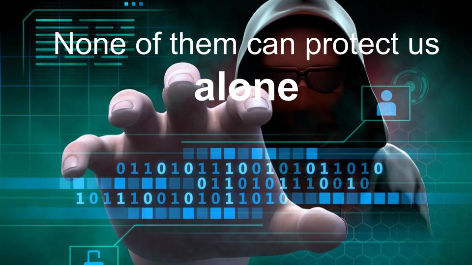
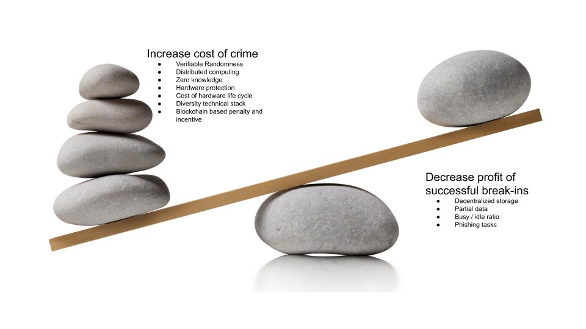
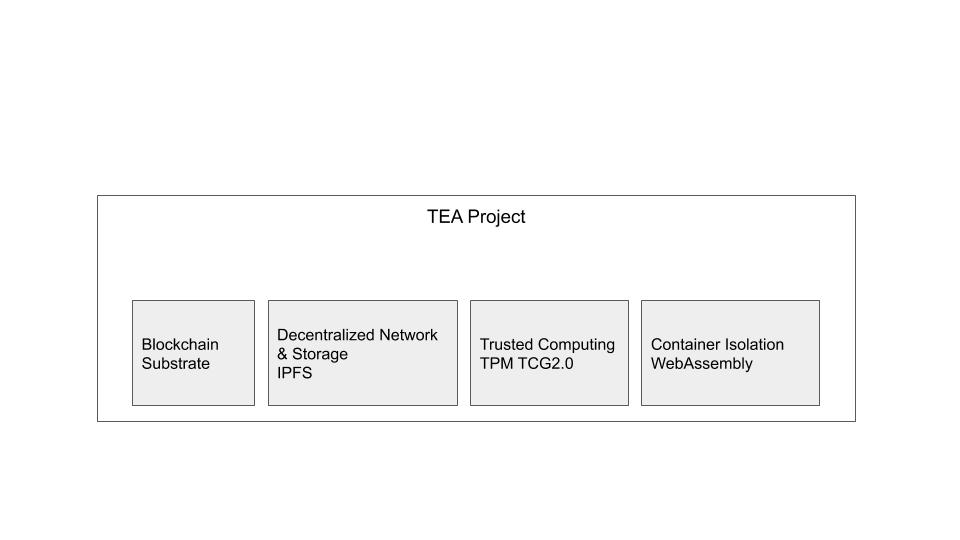
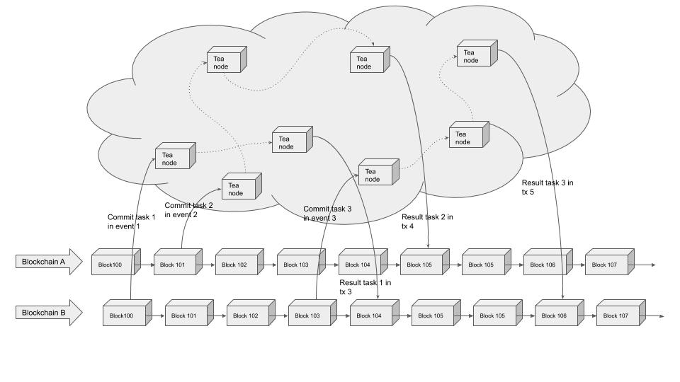

# TEA Project

TEA means Trusted Execution and Attestation. It happens to be one of the favorite drinks for many software developers. That's why coffee and tea are most commonly used as project names by developers, such as Java language, Coffeescript, Jasmine, Mocha, etc. 

In this blog post, we will discover
- What are the problems TEA is trying to solve
- How will TEA solve those problems
- What will TEA be used in the future

# Blockchain 3.0

Blockchain has a short history starting about ten years ago. It can be split into three stages, commonly named Blockchain 1.0, 2.0, and upcoming 3.0.

The typical project of the blockchain 1.0 era is Bitcoin. This is the first time in human history that decentralized trust is established. This is a revolution. However, Bitcoin can only do plus and minus operations. Therefore what Bitcoin can do is just transfer funds between accounts. 

In the blockchain 2.0 era, the typical project is Ethereum (ETH). ETH made a huge step further by introducing smart contracts, much more than plus and minus. Smart contracts are a Turing complete virtual machine that can run relatively complex logic. That's why they are called contracts. 

Existing smart contracts are not perfect yet. Even simple logic may cost a lot, not only money but also time. As long as a contract needs a complex computation, it can hardly run on any blockchain 2.0 platform.
It is not uncommon that many contracts need to run complex computations based on big data or even AI. Currently, they cannot be handled. They need so-called blockchain 3.0. TEA project is one of the solutions. The core value of the TEA project is decentralized trust, complex computation, and big data. As long as those problems are solved, blockchain technologies could be widely used in many cases, which initially have to be handled by a centralized platform. This could be a huge change in human society.

# Computer and trust

Building trust between computers is not a new problem. There are existing solutions in cryptographic algorithms, software technologies, and hardware technologies around this area since computers were invented. I listed a few in the picture, but there are more. While those technologies can solve a particular part of the problem, any single technology has significant limitations. Either make the computation super complex so that it cost more than benefit, or has known vulnerabilities can be broken-in. 

Cloud computing gets popular so that more and more data are centrally stored and processed in some central server. Those data becomes a big bait to hackers. As long as they break into one, they can get a massive return on investment. No doubt that more and more data breaches in recent years.

# Layered solution with token economy

We believe there is no such single technology that can reach the balance between security and cost. The solution is to combine those technologies into a layered solution. The technology in each layer can leverage their most strength while minimizing their disadvantage by utilizing other layers' technologies. This solution could reach a sweet balance between cost, security, and performance. By leverage the blockchain's token economy, we turn the problem from "unable to break into" to "too expensive to break into." Users can set an affordable yet secure enough balance point between cost and security. The higher price you pay, the higher the security level you can get—Vice versa.

# Increase the attacker's cost while reducing their benefit

The motivation of attackers is the return on investment (ROI). In the centralized computing (such as cloud computing) architect, although breaking in is very hard and costly, as long as they can break in once, the benefit is high enough to cover the cost. Not need to mention that they can easily break in other servers using the same technology because the marginal cost is getting lower.

To defeat the attacker's motivation, we can combine existing technologies to do two things:
- Increase the cost of attack attempts
- Decrease the benefit of a successful attack

Once a successful attack's benefit is lower than the total cost of attack attempts, there is a negative ROI to the attackers. They either give up or turn to other low hanging food.

Here is the TEA project's main point; We combine existing technologies into a multi-layer solution to get a perfect balance between cost, security, and performance. This idea is exactly how blockchain builds decentralized trust. For example, Hacking the Bitcoin ledger is technically doable but economically not possible due to the cost. Bitcoin has been running for more than ten years. Everything in Bitcoin is open-sourced. Everyone knows how to modify the bitcoin ledger but never be done. The beauty of blockchain consensus and token economy.

When data stored in a single known location, it becomes a big bait to hackers. If we distribute the data into many different nodes (we used IPFS with small modification), each site owns a small portion of the data and is protected by different technologies. Attackers have to get all or most of the data pieces to make it useful. This will significantly increase the attacking cost since the marginal cost is high. Even the attackers can hack into one location to get a small portion of valuable data. This small portion is protected by cryptography and worth nothing unless combine with other pieces. Attackers still have to spend the same or maybe higher cost to break into other locations or all locations to make the data valuable. Not to mention by using the Zero-Knowledge algorithm, the attackers have no way to know if their current target is worthwhile or just a phishing bait. The risk, cost, and benefit are not predictable. This can hugely defeat the attackers' motivation.

In this picture, we listed the technologies we used in the TEA Project. We will go through them in the following slides. 

# Three chains technical architect

We group the technologies into three categories. We call them three chains: 

- Blockchain
- Trust chain
- Delegation chain

In the TEA project, the root-of-trust (RoT) comes from two dimensions: Hardware root of trust (Hardware RoT) and software root of trust (Software RoT). The hardware RoT can be TPM of Trusted Computing Technology or CPU TEE. The software RoT is blockchain.

We leverage blockchain's immutability to do two things. 
- Store the important trust data. Once they are saved, there is no way to modify
- Smart contracts to run governance and consensus. Token economy happens here

One thing needs to mention. The blockchain in the TEA project doesn't make a consensus on the result of the computing result. Instead, it makes a consensus on PoT (Proof of Trust) to all involved nodes to ensure the whole workflow and execution environment is secure. The blockchain itself won't touch or store any secrets. 

The trust chain definition as quoted from Wikipedia:
 "In computer security, a chain of trust is established by validating each component of hardware and software from the end entity up to the root certificate." It is intended to ensure that only trusted software and hardware can be used while still retaining flexibility. In the TEA project, the root of trust can only come from hardware. Currently, we accept TPM or CPU TEE as the hardware root of trust (RoT). We knew that even the hardware RoT has vulnerabilities, but by combine the hardware trust chain with blockchain and delegation chain, the risk is minimized to be acceptable.

The hardware root of trust (RoT) generate proof of trust (PoT) data at runtime. The PoT data is stored and evaluated by random remote verifiers using blockchain consensus. The randomness of the remote verifiers is guaranteed by both blockchain and delegation chain. The randomness can be verified too.

The delegation chain is a network protocol. It guarantees that all the secrets to being kept inside and transferred between verified trusted hardware only. The protocol also maintains verifiable randomness when distributing the data to their hosting (we call it Pin and Repin). The whole data distribution flow can be traced by a series of signature chained together. That's why it is called a delegation chain. With the same blockchain methodology, altering the traceable delegation chain data is hard once the chain is set. Due to the randomness and zero-knowledge nature, no one, including the node's owner, cannot control and won't know what a node is currently running or about to run. The randomness and zero-knowledge increased the risk and cost of potential attackers. The traceable delegation chain records will be released to the blockchain after the computation is completed. At that moment, all the data has been wiped out. Attacking is useless.

# Four technical pillars of TEA project

TEA project is based on four modern technologies. 

Firstly, blockchain technology. There is a blockchain inside the TEA project. We call it tea-layer-1 internally. It is developed on top of Substrate. Substrate is the blockchain development toolkit from Polkadot. Because TEA is based on Substrate, it would be effortless to communicate and collaborate with other blockchains in Polkadot ecosystem. But it doesn't mean TEA can only work with Substrate based blockchains. TEA can work with any client blockchain or not a blockchain at all. It is just easier when the client is Substrate based due to the inter-chain communication protocol. The additional reason we chose Substrate is that Substrate is developed using Rust programming language and WebAssembly as compiling target. This technical stack is the same as TEA. We like Rust and Webaseembly too.

Secondly, IPFS (the inter planet file system) is used as our network layer and storage layer. We chose IPFS because it is one of the mature distributed storage solutions with considerable community support. One of the TEA project's use cases is to add computing functionality to existing IPFS nodes. We call it a new definition of IPFS (Inter planet functional services). The network layer from IPFS, called LibP2P, is the base layer of our Delegation chain network. 

Thirdly, the hardware trusted computing technology. This is how the Trust Chain work. We used a Nations Tech TPM chip on a Raspberry Pi as our testing environment in our current demo. But that doesn't mean we support TPM only. Any hardware trusted computing technologies could be applied as long as they can bring a Proof of Trust on which other nodes to agree. In the TEA project, we do not decide whether a node is secure or not. We provide a consensus on what most nodes agree on. In other words, TEA is neutral to all trusted-computing-technologies. 

Last but not least, isolated container technology. We chose WasCC WebAssembly runtime as our base. WebAssembly is a new technology that recently got attention in the blockchain and cybersecurity area. WebAseembly brings us a higher level of isolation with security built-in. It also makes code small and portable to let TEA move wasm code around the network to fit different business needs. Once you deployed your code to the TEA network, you cannot and do not need to know which TEA node hosts or run your code. All the workflows are handled inside the trusted secure environment with zero-knowledge protection. You can see this is significantly different than traditional cloud computing, that you know where your code is hosted and run. From the developer's point of view, they do not need to learn a new programming language because WebAssembly is rather a compiling target than a programming language. Most of the modern programming languages config WebAssembly format as their compiling target. 

So we cherry-pick all the four modern technologies, combine them into three chains (or tiers) to become a new decentralized computing solution - The TEA Project.

The TEA Project not only leverage those technologies but also make extension and enhancement to those technologies. 

# TEA Project as a layer-2 trusted computing oracle to other client blockchain

The TEA Project not only leverage those technologies but also make extension and enhancement to those technologies. 
To Blockchain, we consider the TEA Project a layer-2 trusted computing oracle. TEA helps our client blockchain to offload the complex computation to our TEA layer-2 so that our client can focus on business logic only. Those complex computations were either too slow or too expensive to be running on traditional blockchains.  The smart contracts can send the computing tasks to the TEA network as if an async internal RPC call inside their Blockchain. The TEA network will do the heavy lifting work and finally send the result back to the client Blockchain with a series of Proof-of-trust signatures. The client blockchain can easily verify those PoT to trust the outcome then resume the original smart contract process. This method can turn a lot of complex business logic from impossible to possible.

# Turn IPFS (Inter Planet File System) to new definition IPFS(Inter Planet Function Services)

IPFS is awesome! It allows you to store your code or data in the middle of nowhere. When you need them, you can get it from somewhere you do not really care about. You can verify the hash to make sure this is exactly what you request. How cool is that!

However, it is just a File System so far. If you need to run your code, you probably have to load the code from IPFS to some centralized cloud services (Amazon, Google, etc.) first. If you could run your code directly in an IPFS node, you will need to get the result directly, so that you saved your code a side trip to computing servers. You do not really need the code; what you need is the result, right?

The TEA Project designed the TEA module hardware that can be plugged in existing IPFS nodes. The module is protected by hardware trusted computing technologies and TEA software consensus. The code and data can be decrypted and run inside the trusted environment. These workflows are monitored and verified by other trusted TEA nodes driven by the TEA consensus algorithm. In this case, you can send a request to IPFS nodes and expect the function result as a response instead of the source code. You can see the File System converts to Function Services.

# Extend the trusted computing beyond the hardware boundary

