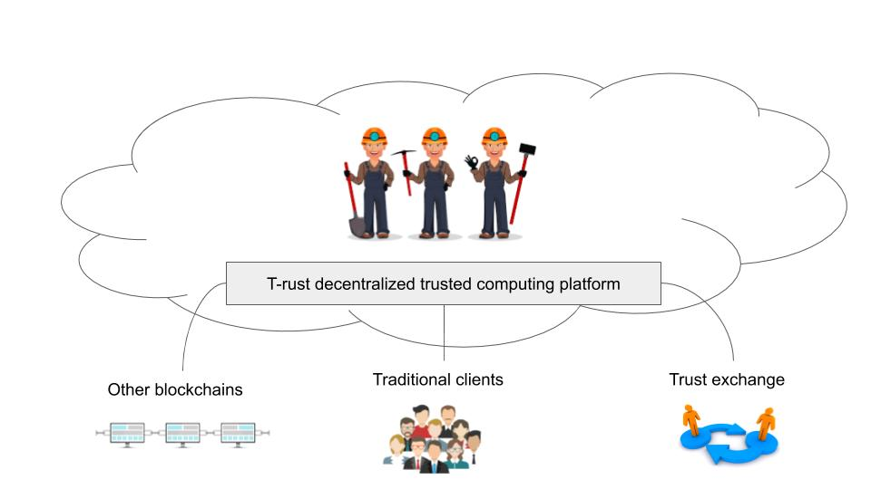
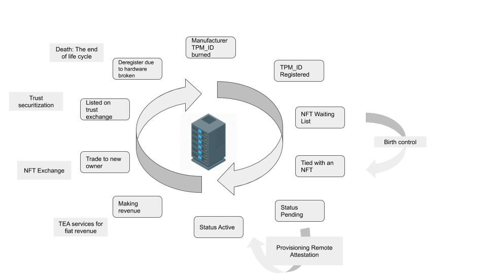

# Decentralized trusted computing services
In our last talk, we went through the technical architect of the TEA project. We know there are a lot of creative ideas. Let's talk about the business model. There are more creative ideas to come.

As we mentioned at the end of our last talk, the TEA project can be considered decentralized computing services but not owned or operated by any single entity. Anyone can join the TEA network as a miner to provide trusted computing services. It is more like an open community. Community members offer services and share the revenue. All of them need to follow the same rule called consensus so that the collaboration can be smooth and fair to everyone. 

Because we shift most of the management cost to the DAO, we do not need to take the 30% cut as Uber did to cover the operational cost. The miners take almost all the revenue generated from the service. I say "almost" because there is still a minimal cost for so-called "public services" need to be covered. The public services typically include bootstrap nodes, IPFS accelerator, jury duty, general marketing, etc. The beneficiary is the general public but cannot be paid by any particular member. In traditional human society, this kind of cost is covered by government tax. We try not to take a cut from our miners. I will explain how we get this cost covered after the double loop business model first.

# Double loops
T-rust has a specially designed double-loops. It segregates the cryptocurrency loop and fiat currency loop. There is no exchange between crypto and fiat so that prevent any crypto-related legal issue. Furthermore, it provides a way to invest in crypto while gaining revenue in fiat.

Investors pay crypto (such BTC) to invest an NFT (Non-fungible token). Every NFT ties to a physical mining machine. This mining machine joins the T-rust to running trusted computing services to clients who pay fiat as service charge. The fiat revenue returns to the investor as ROI (Returns on invest).

The NFT's values are the profitability of the mining machine. Every mining machine is unique. Its credit history and performance history determine how much revenue it can generate. The investor can sell the NFT for crypto in TEA exchange for capital gain if the value goes up.

The NFT can be sold in whole or in shares. This is called Trust Securitization. That means you can buy a share of a profitable NFT as if it is a stock of a company.

Buy and sell an NFT doesn't need to physically relocate the mining machine. It is still where it was. Just the ownership and profit account directly to the new owner.

This is a new way to invest your crypto while earning fiat legally. This business model is exactly the opposite of Bitcoin mining, which spend fiat to buy machines and pay utility then min crypto as revenue. Bitcoin machines depreciate very fast but T-rust mining NFT is supposed to increase in value because of the credit gains over time.

# Life cycle of a NFT->Mining machine and social mobility
A community-driven project is very similar to human society. A healthy society needs social mobility. Otherwise, the existing old members will occupy all leading position and control the rules so that new join nodes won't get chance ascending. To prevent this, we introduce the life cycle just like human-being. All human will die eventually, it sounds cruel but it is how human being revolution. The TEA node, refer as NFT, will die too. Over time, the machine will break or obsolete due to ageing. We do not allow the credit of a dead TEA node to transfer to a new TEA node even if they are owned by the same owner. When a tea node dies, the credit is gone as well.

# Birth control

Death of any existing TEA node is out of control, but the birth rate is carefully controlled by layer 1 smart contracts.

Just like the Bitcoin automatically adjust difficulties based on block rate. T-rust will adjust the birth rate based on the overall workload of existing T-rust nodes. If there are too many tasks in the waiting list that cannot be processed for a while, the birth rate will increase. More new nodes are allowed to join the T-rust. On the other side, if many TEA nodes are idle waiting for tasks for a while, the birth rate will decrease to protect the profitability of existing nodes.

When there are fewer new node headcount as more new miners want to join. An auction takes place. This is how the public services funding somes from. 

