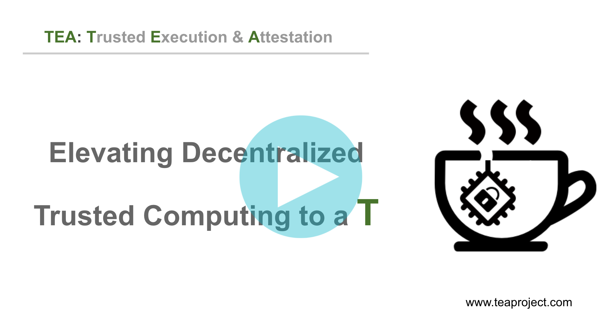
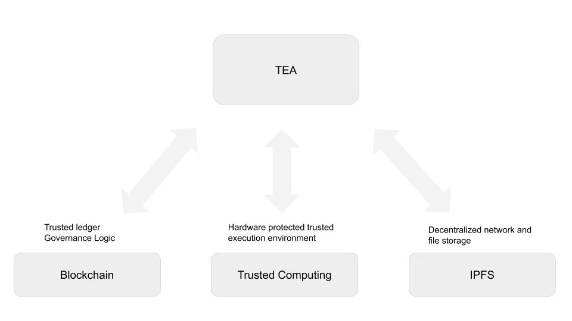
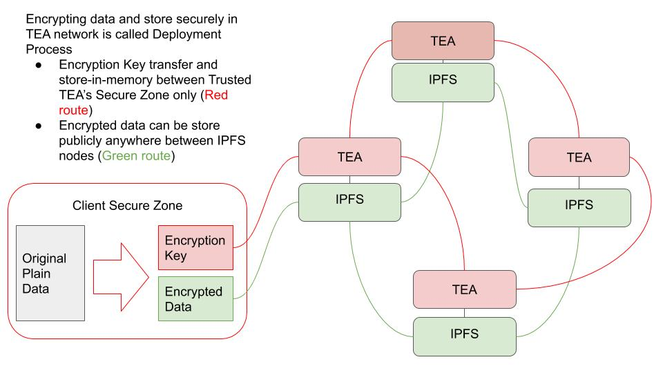
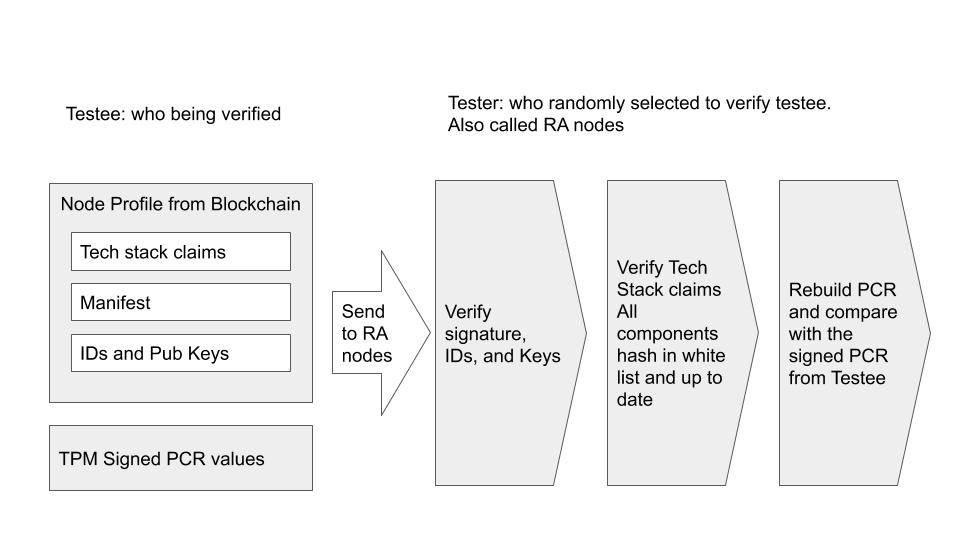

# TEA Project

TEA stands for Trusted Execution and Attestation. It also happens to be the favorite drink of many software developers. That's why coffee and tea are commonly used as project names, for example Java, Coffeescript, Jasmine, Mocha, etc.

In this blog post, we'lll discover:
- Which problems TEA is trying to solve.
- How TEA solves these problems.
- And what TEA will be used for in the future.

# Blockchain 3.0

Blockchain has a short history that started about ten years ago. It can be split into three stages, commonly called blockchain 1.0, 2.0, and the upcoming 3.0.

The defining project of the blockchain 1.0 era is Bitcoin. Bitcoin marks the first time in human history that decentralized trust is established. This was truly a revolution. However, Bitcoin only performs plus and minus operations, limiting its functionality to fund transfers.

In the blockchain 2.0 era, Ethereum (ETH) started to take the spotlight. ETH made a giant leap by introducing smart contracts that are able to do much more than Bitcoin’s plus/minus functions. Smart contracts are Turing complete virtual machines that can run relatively complex logic. That's why they're called smart contracts.

Modern smart contracts are not perfect yet; even simple logic may take a lot of time and cost a lot of money. Contracts that require complex computations can barely run on blockchain 2.0 platforms.

Use cases such as big data and AI require highly complex computations. Currently, they cannot be handled at scale; for that, we need blockchain 3.0 technologies.

TEA is one of these third era solutions. The core components of the TEA project are decentralized trust, complex computation, and big data. As long as the issues that these topics raise are solved, blockchain technologies could be used across the board. Initially, this would have to be handled by a centralized platform.

# Computers and Trust

Building trust between computers is not a novel goal. There have been existing solutions with cryptographic algorithms using software and hardware technologies since the dawn of the computer age. I’ve listed a few in the picture, but there are more. While those technologies can each solve a particular part of the problem, any single technology carries significant limitations: either through known vulnerabilities or by making computation very complex—to the point that it brings more costs than benefits.

As cloud computing increases in popularity, more and more data is stored and processed in a centralized manner. All this data in one place is big bait for hackers and bad actors. If they can break into one of their targets, they get a massive return on their investment. This is reflected in the increasing amount of data breaches in recent years.

# Layered solution with a token economy

We believe there is no single technology that can optimally balance security and cost on its own. The answer lies in combining multiple technologies into a layered solution. The technology in each layer can leverage its strengths, and minimise its disadvantage by leaning on the technologies in the other layers. Such a solution could be tweaked to reach the desired balance between cost, security, and performance.

By leveraging the token economy made possible by the blockchain, we turn the security premise from "very hard to break into" to "very expensive to break into". Users can set an affordable yet secure enough balance point between cost and security based on their needs. The higher the price you pay, the higher the level of security you can get—and vice versa.

# Increasing the attacker's cost while reducing their benefit

The motivation of attackers is the return on investment (ROI). Although breaking into centralized computing (such as cloud computing) architectures is very hard and costly, the benefit of a successful attempt far exceeds the cost. Successful attackers can then easily break into other similar centralized targets using the same method as the marginal cost of attack is lowered.

To thwart the attacker's aspiration, we can combine existing technologies to do two things:

- Increase the cost of attack attempts.
- Decrease the benefit of a successful attack.

Once the benefit of a successful attack is lower than the total cost of such an attempt, there is a negative ROI for the attackers. They will either give up or turn to other low hanging fruit.

It's here that we find the TEA project's main purpose: we combine existing technologies into a multi-layered solution to get a perfect balance between cost, security, and performance. This concept mirrors how blockchain builds decentralized trust. For example, hacking the Bitcoin ledger is technically doable, but economically improbable due to the cost. 

Bitcoin has been running for more than ten years, and everything in Bitcoin is open-sourced. Everyone knows how to modify the Bitcoin ledger, but never has it been successfully used for an attack. This is the beauty of blockchain consensus and token economy.

When data is stored in a single known location, it becomes big bait for hackers. If we distribute data across many different nodes (we use IPFS with small modifications), each site holds a small portion of the data and is protected by different technologies. Attackers have to get all or most of the pieces of data to make an attack useful. This will significantly increase the cost of an attack, and even if the attackers can hack into one location to get a small portion of valuable data, this small portion is protected by cryptography and worth nothing unless combined with other portions of data to complete it. Attackers would still have to spend an equal or higher amount to break into other locations (or all locations) to make the data valuable. 

Not to mention, by using the Zero-Knowledge algorithm, the attackers have no way of knowing if their current target is worthwhile or just valueless bait. The risk, cost, and benefit are not predictable; this can largely suppress the attackers' motivation.

In this picture, we listed the technologies we used in the TEA project. We will go through them in the following slides.

# Three chains: technical architecture

We’ve grouped our technologies into three categories, made up of three chains:

- Blockchain.
- Trust chain.
- Delegation chain.

In the TEA project, the Root of Trust (RoT) comes from the hardware. The RoT generates a Proof of Trust (PoT) which is then processed and stored by the blockchain. Because the blockchain is immutable, the stored PoT can always be verified and trusted.

The hardware RoT can be a TPM of Trusted Computing Technology or a CPU's TEE.

We leverage the blockchain's immutability to do two things:

- Store the important trust data. Once the data is saved, there is no way to modify it.
- Use smart contracts to run governance and consensus which forms the basis of our token economy.

One more thing needs to be mentioned: the blockchain in the TEA project doesn't reach consensus on the result of the computing that is performed. Instead, it reaches consensus through PoT (Proof of Trust) with all involved nodes to ensure the entire workflow and execution environment is secure. The blockchain itself won't touch or store any secret data.

The trust chain definition, as quoted from Wikipedia, is as follows: "In computer security, a chain of trust is established by validating each component of hardware and software from the end entity up to the root certificate." It's intended to ensure that only trusted software and hardware can be used while still retaining flexibility.

Currently, we accept TPM or CPU TEE as the hardware Root of Trust (RoT). We know that even the hardware RoT has vulnerabilities, so we combine the hardware trust chain with blockchain and a delegation chain to minimise the risk to an acceptable level.

The hardware Root of Trust (RoT) generates Proof of Trust (PoT) data in the runtime. The PoT data is stored and evaluated by random remote verifiers using blockchain consensus. The randomness of the remote verifiers is guaranteed by both the blockchain and delegation chain. The randomness can be verified too.

The delegation chain is a network protocol. It guarantees that all the secrets are kept inside and are only transferred between verified trusted hardware modules. The protocol also maintains verifiable randomness when distributing the data to its hosts (we call it pin and repin). The entire data distribution flow can be traced by a series of signatures chained together, which is why it's called a delegation chain. 

Using blockchain methodology, altering the traceable delegation chain data becomes hard once the chain is set. Due to its inherent randomness and zero-knowledge nature, no one, including the node's owner, can control or know what a node is currently running or about to run. The randomness and zero-knowledge aspects increase the costs and risks for potential attackers. The traceable delegation chain records are released to the blockchain after the computation is completed. At that moment, all the data has been wiped and attacking becomes useless.

# Four technical pillars of TEA

The TEA project is based on four modern technologies.

**1. Blockchain technology** is a core component of the TEA project. We internally call it tea-layer-1. 

It is developed on top of Substrate, a blockchain development toolkit by Polkadot. Because TEA is based on Substrate, it will be effortless to communicate and collaborate with other blockchains in the Polkadot ecosystem. Of course, this doesn't mean that TEA is limited to working with Substrate-based blockchains only. TEA can work with any client blockchain or even with non-blockchain clients. Then again, it will be easier when the client is Substrate based due to the inter-chain communication protocol. An additional reason for choosing Substrate is that the protocol is developed using the Rust programming language and has WebAssembly as its compiling target. This technical stack is the same as TEA’s: we like Rust and WebAssembly too :)

**2.IPFS** (the inter-planetary file system) is used as our network and storage layer. We chose IPFS because it is a mature distributed storage solution with considerable community support. One of the TEA project's use cases is to add computing functionality to existing IPFS nodes, adding a new definition to IPFS (inter-planetary *functional services*). LibP2P, the network layer of IPFS, is the base layer of our delegation chain network.

**3. TPM** is our primary hardware-based trusted computing technology. A hardware trusted computing module is the basis of how the Trust Chain works. In our current demo, we use a TPM chip by Nations Technologies on a Raspberry Pi as our testing environment. This doesn't mean we only support TPM as any hardware trusted computing technology could be applied, granted that it can deliver a Proof of Trust on which other nodes can agree. In the TEA project, we do not decide whether a node is secure or not; we provide a consensus on what most nodes agree on. In other words, TEA is neutral to all trusted computing technologies.

**4. WasCC WebAssembly** forms the basis of our isolated container technology. WebAssembly is a new technology that has recently gotten attention in the blockchain and cybersecurity area. WebAseembly brings us a higher level of isolation with security built-in. It also makes code small and portable to let TEA move Wasm code around the network to fit different business needs. 

Once you’ve deployed your code to the TEA network, you cannot and do not need to know which TEA node hosts or runs your code. All the workflows are handled inside the trusted secure environment with zero-knowledge protection. You can see this is significantly different than traditional cloud computing, where you know where your code is being hosted and where it runs from. On the developer's end, there is no need to learn a new programming language because WebAssembly is a compiling target rather than a programming language. Most of the modern programming languages can be compiled to WebAssembly format.

So, we’ve cherry-picked four of the top modern technologies in their respective sectors, and combined them into three chains (or tiers) to form a new decentralized computing solution: the TEA Project.

# TEA as a layer-2 trusted computing oracle

The TEA project not only leverages but also extends and enhances the aforementioned technologies. For client blockchains, the TEA Project can be a layer-2 trusted computing oracle. TEA serves client blockchains by offloading complex computation to TEA's layer-2, allowing clients to focus on business logic only. These complex computations would be either too slow or too expensive to run on traditional blockchains. 

Smart contracts can send computing tasks to the TEA network as if it were an asynchronous internal RPC call inside their blockchain. The TEA network then does the heavy lifting and sends the result back to the client blockchain with a series of Proof of Trust signatures. The client blockchain can easily verify the PoT to trust the outcome, and then resume the intended smart contract process. This method opens up to ability to execute a lot of complex business logic that was previously considered impossible.

# IPFS redefined

IPFS is awesome! It allows you to store your code or data in the middle of nowhere. When you need it, you can get it from anywhere, the exact source is irrelevant. You can verify the hash to make sure you received exactly what you’ve requested. How cool is that?!

Still, IPFS is just a "File System" as of now. If you need to run your code, you probably have to load the code from IPFS to some centralized cloud services (Amazon, Google, etc.) first. If you could run your code directly inside an IPFS node, you would be able to get the result directly, saving your code from an unnecessary trip to the centralized (and vulnerable) computing servers. After all, you do not really need the code; what you need is the result, right?

We’ve designed a hardware TEA module that can be plugged into existing IPFS nodes. The module is protected by hardware trusted computing technologies and TEA’s software consensus. The code and data can be decrypted and run inside the trusted environment. These workflows are monitored and verified by other trusted TEA nodes driven by the TEA consensus algorithm. You can send a request to IPFS nodes and expect the function’s result as a response instead of the source code. This is how the File System (“FS" in IPFS) is converted to create Inter-Planetary **Function Services**.

# Extending trusted computing beyond hardware boundaries

Proof of Trust (PoT) is the essential security-related data collected from the hardware security chip. Unlike traditional attestation performed by the owner, we use blockchain consensus to select remote attestation verifiers (RA nodes) to attest to the PoT. Every single verifier signs its result and commits it to the blockchain. Once the blockchain has received enough verifications to run a BFT-algorithm, the result is posted on the blockchain. Therefore no one can predict who will be the verifier of a data set, leaving no room for collusion.

Before remote attestation, the testee needs to post its "claims" on the blockchain. The PoT to support its claims is sent to the RA nodes, and the RA nodes test if the PoT matches its claim. If the PoT matches the claim, the RA nodes will send the positive result to the blockchain (positive means the claim is valid). Other TEA nodes can check the claim of a node to decide whether to trust it or not.

In the TEA project, most decisions are made in a decentralized manner. Every node can determine whether to trust or not trust the dApp's business logic. The RA process is to attest if a node's claim is honest. 

Therefore, TEA is security technology agnostic. As long as there is consensus, any technology can be used. We do not tell you if a node is trustable or not; we just tell you what it claims and whether the claim is correct or not. From there, you make your decision.

# TEA: traditional cloud computing gone decentralized

TEA's trusted computing service is similar to a traditional cloud computing service, but decentralized. You do not need a centralized form of trust. Instead, we use TEA's hardware and software components.

A decentralized cloud service is one of the first business models that comes to mind. However, we are not looking to run the next Amazon EC2 or Google Function services. We focus on the business models of the decentralized world, and do not need to buy tons of servers to build data centers. Just like Uber or Airbnb, the largest taxi company and hotel chain respectively, do not own any car or hotel room, we do not need to own any TEA nodes either.

Anyone can download the code from our GitHub and run their TEA node from anywhere. The trust does not come from a user's reputation or geolocation; the trust comes from the hardware and blockchain consensus. We link all these TEA nodes together to become the world’s largest trusted computing network. Just like IPFS provides file storage, we provide inter-planetary computing services.

Taking things one step further than Uber or Airbnb did, we decentralise the management to a DAO—this is possible because the system runs on the blockchain. We do not need to take a 30% cut from our node owners' revenue as Uber does. If you're curious, you can learn more about [TEA's business model](https://teaproject.org/#/doc_list/%2FBlog_and_Vlog%2FTEA_Project_business_model.md).
