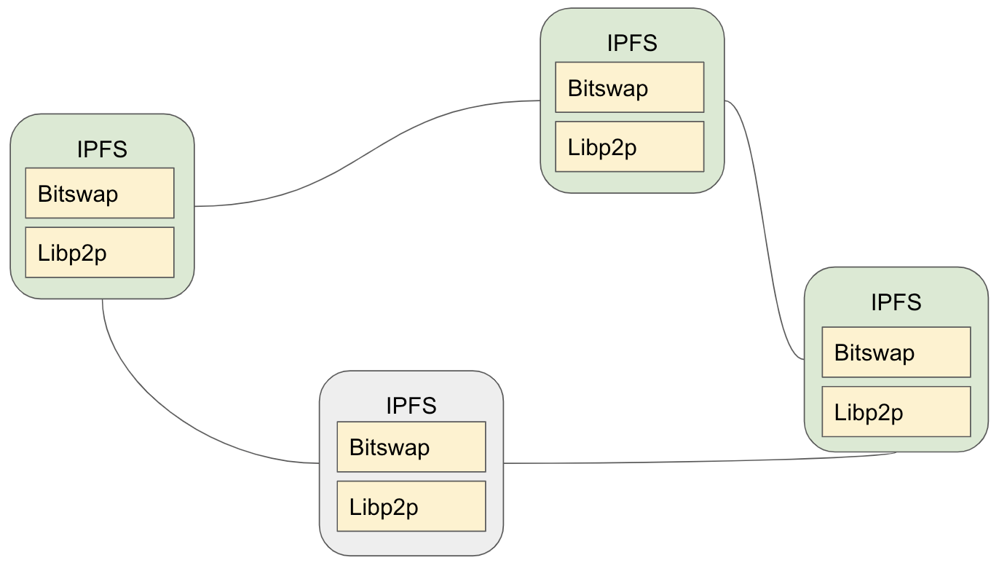
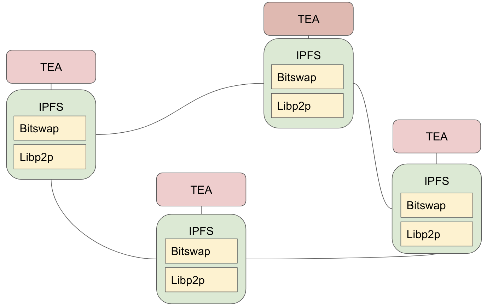
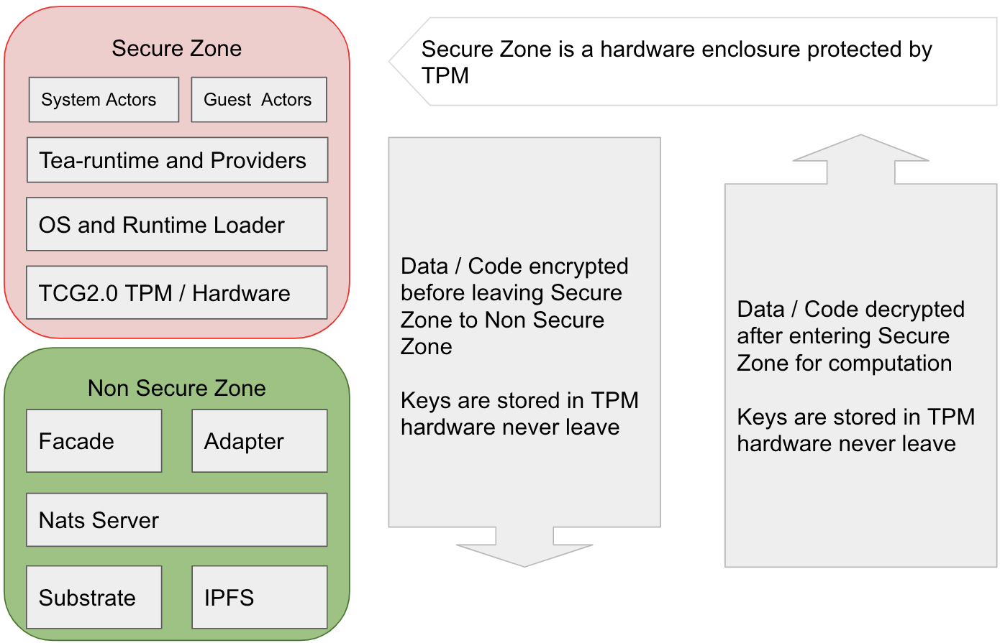
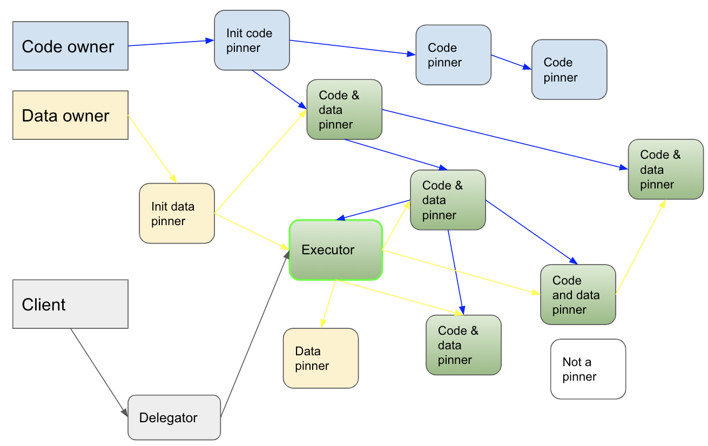
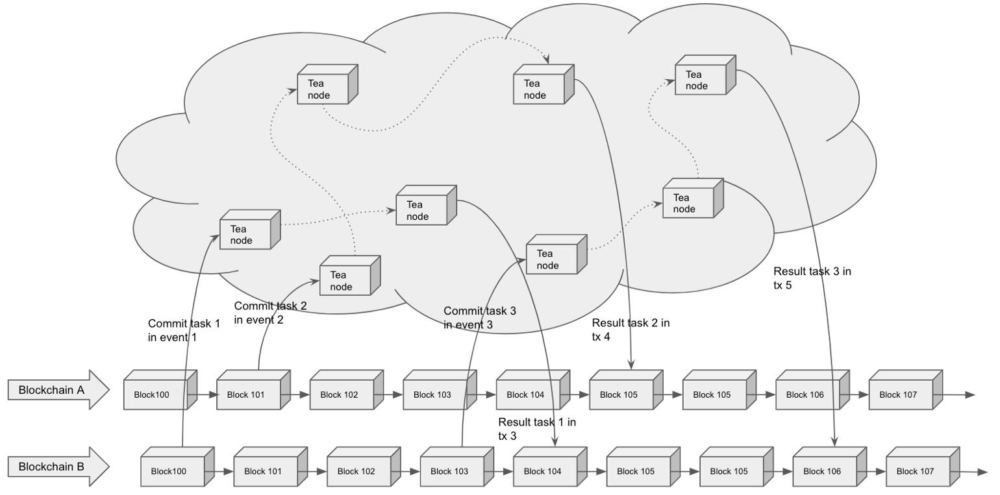
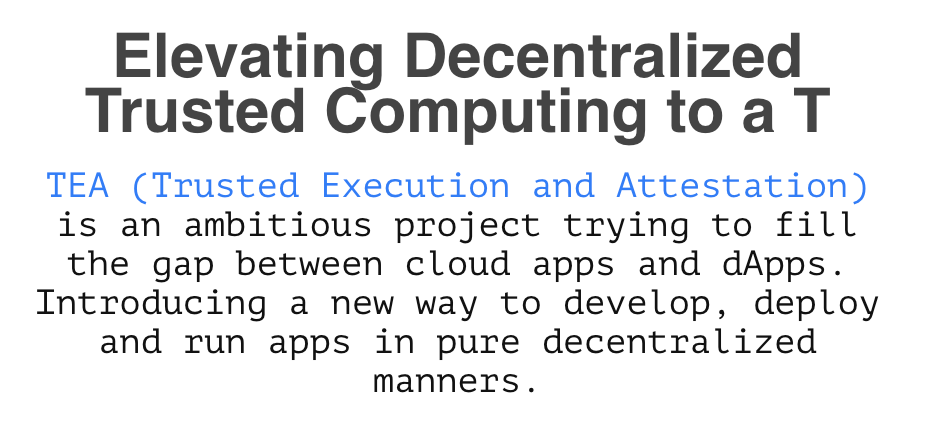
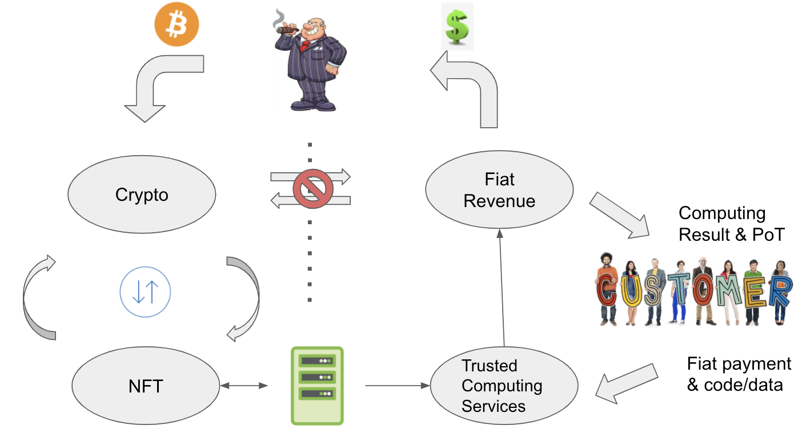
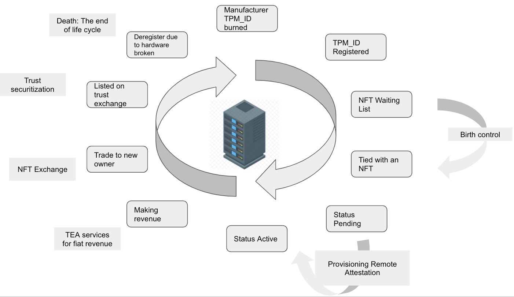

# Turn IPFS(File System) into new IPFS(Function as a Service) by adding some TEA

IPFS is awesome! It allows you to store your code or data in the middle of nowhere. When you need them, you can get it from somewhere you do not really care about. You can verify the hash to make sure this is exactly what you request. How cool is that!

However, it is just a File System so far. If you need to run your code, you probably have to load the code from IPFS to some centralized cloud services (Amazon, Google, etc.) first. If you could run your code directly in an IPFS node, you will need to get the result directly, so that you saved your code a side trip to computing servers. You do not really need the code; what you need is the result, right?

# How do I know the result is correct?

If you were getting a piece of data from IPFS, you do not worry too much about the correctness of the result. You can easily verify the result by hashing it. The CID should match. But if you get a result of a computation of a piece of code and a piece of data, you do not know the result yet, not to mention the hash of the result. How do you verify?

# A quick answer: You do not

Since you do not know the hash of the correct result, you cannot verify using the traditional way, and you do not need to. What you can verify is the Proof of Trust (we call it PoT, Tea-Pot). The PoT is simply a series of valid proof of how your code or data is processed in the T-rust network. The math and silicon physics protects the computation process so that as long as you can verify the PoT, you can trust the correctness of the result.

BTW, if you are new to my channel, T-rust is a d-App platform built by the TEA project team. To learn more about TEA and T-rust, go to HTTP://t-rust.com website and try the demo.

# How does it work? Basically?

A typical IPFS network with four nodes works like this:

Sorry, I try to make the illustration as simple as possible. I know IPFS is more complicated than that, but my point is not there.

Now we add a “TEA module” to some IPFS nodes (In the diagram below, all nodes have a TEA module, but they do not have to)

The TEA modules is a small cheap computing unit with TPM chips built-in. In our demo, we used a Raspberry Pi Single Board Computer ($30) plugged with a Nation Technologies TPM Chip (Unknown price, which could be $1 or so). In theory, any circuit board with CPU and TPM works, such as Nano Pi which I think may work better than Raspberry Pi.

The TEA module connects to IPFS only. It replies on IPFS and LibP2P to provide storage and network. TEA modules connect to other TEA modules using a secured connection (security keys protected by TPM hardware) becomes a layer-2 network. Although physically, all information between TEA modules needs to go through IPFS’ network, the communication is worry-free due to hardware encryption.

All computation works and the decryption are processed inside the hardware protected secure module. The TPM monitors the whole hardware running even before the system boot. All the critical security evidence is stored in TPM as PoT. The PoT will be sent to layer 1 blockchain for Remote Attestation by other VRF selected “known good” TEA nodes. The consensus is done at the blockchain layer (we the blockchain layer layer-1). The clients only need to query the layer-1 blockchain to verify the PoT is posted in a valid block so that they can trust the correctness of the computing result. Sorry about the long sentences in this paragraph. Let’s break them down into human language.

# Discover the TEA module

These are the logic blocks of a TEA module. The red “secure zone” is running inside the protected area, in our demo case, it is a raspberry pi single board computing with a Nations Technologies TPM chip plugged in. The green “non-secure zone” is outside of the raspberry pi. It could be inside your IPFS node or standalone server as long as they are all in the same LAN. Because they are non-secure, all sensitive data has been encrypted before entering this area, no additional protection needed.

If you are new to blockchain or trusted computing, I am pretty sure you could be confused by those new terms in the diagram. Because we will only focus on IPFS in this blog post, so I would recommend you to read the documents of the TEA project to get background knowledge. Here is the [link to trusted computing](http://t-rust.org/#/doc_list/%2FWhat_is_TEA%3F%2FTEA_vs_Trusted_computing.md) and the [link to the blockchain](http://t-rust.org/#/doc_list/%2FWhat_is_TEA%3F%2FTEA_vs_blockchain.md).

# Do you mean I can store encrypted data in IPFS with TEA’s help?

Yes! It is much more than saving encrypted data to IPFS and keeping the key in your pocket. Your key can be protected by and transferred between TEA modules. You can define who, when, and how the key to be used using the logic defined in your dApp (or blockchain smart contracts too). Only those who meet the predefined condition can unlock your data and consume it.

Since you can define the condition, you would write the logic like

- Pay $1 every time someone uses your data
- Only allow load when code is running inside a protected secure zone
- Only allow load by TEA nodes listed in an allow-list, or block in a block-list.
- Expire after a specific expiration date
- Run for free for the first 10 times as new users, after that charge $2 every hour…

There are many business logic that can be achieved here.

You can see, TEA not only protect your data but also make your data *profitable!*

The process of uploading your encrypted data is called “Deployment” in T-rust.

Let’s reuse this diagram again:

Before the sensitive data leaving your comfort zone (eg, your browser), the data is encrypted by a random key. We call the key K1, the data D1. D1 is stored in IPFS worry-free because it has been encrypted. The K1 will never be exposed to the public in its whole lifetime. It will be stored inside in TEA modules’ memory without persistent storage, or transferred between TEA modules using secure channels.

The process of distributing K1 is called “Repin”. The TEA modules who owns a copy of K1 is called “Pinner”. The first Pinner is called “Initial Pinner” or “Delegator”.

If you own a TEA module yourself, you should select it as your delegator. If you do not, you can select any public available TEA modules online. Usually, I would recommend you choose one from well-known high credit-score bootstrap TEA modules because they are generally more reliable.

When the initial pinner received your K1. It will generate a Deployment_ID to this K1/D1 pair. You will get the Deployment_ID as it refers to the K1/D1 pair. The Initial pinner will broadcast to the IPFS network (Kad via LibP2P) that it owns this deployment as well as post an event to layer 1 blockchain. Other TEA modules either get this information from layer1 blockchain or get the deployment_id from other channels( eg. dApps). If that pinner would like to own K1 as well, it becomes a “wanna-be pinner”. The wanna-be pinner IPFS DHT Findprovs to find who always “pinned” this deployment_id. If found, ask to “repin”. The Pinner need to carefully run a remote attestation to make sure that the wanna-be pinner is qualified. The qualification logic can be predefined by you. Basically, only hardware protected TEA modules can be considered. After the remote attestation passed, the pinner will send the K1 and deployment_id’s private key to the wanna-be pinner. The wanna-be pinner is no longer a wanna-be, it becomes a real pinner. It can broadcast to the Kad libP2P that he is pinner of this deployment_id too.

There are financial motivations behind the process. For more on the business model please [read this document](http://t-rust.org/#/doc_list/Business_model%2FREADME.md).

Those pinner TEA modules actually have a copy of K1 in its secure memory, and the D1 is in IPFS. So as long as someone needs to consume D1, it can easily use IPFS DHT Findprov deployment_id to find who the pinners are. Those pinners would be executor in the next step.

# Run the code securely in an executor protected by TEA

From now on, we separate the usage of code and data. although code is also data from a storage point of view, code can execute as a function but data can become the parameter of this function.

Let’s assume both code and data have been deployed and repinned by many TEA modules. When someone (the client) pays to run the code against the data, he creates a task. In the TEA project, we call those small tasks “errands” because they are just a function call. The client post the errand and payment to the layer 1 blockchain. All the existing pinners will receive the event from layer 1. They compete to get a chance to run this errand. The winner (executor) will get the money from the client. Well, not alone, there are other roles to share I will explain in a minute.

The competition is a complex algorithm we call “Delegation chain” in the TEA project. For the detail on the delegation chain please [read this document](http://localhost:3000/#/doc_list/%2FUnder_the_hood%2FDelegation_chain.md) on the t-rust.com website.

The delegation chain algorithm can find the best suitable executor using the VRF algorithm from those competitors and a group of verifiers. The verifiers do not run the code, but run remote attestation on the executor to make sure it doesn’t try any monkey business. After the execution completed, the encrypted result along with those PoT from verifiers are sent to the layer1 blockchain. After a blockchain consensus, a confirmation will be posted in a new block. Because the blockchain we are using (Substrate from Polkadot) is deterministic, the result is confirmed at this moment. The client can verify the new block’s PoT then trust the result’s correctness.

All the executor, verified, and delegators will share the revenue based on predefined business logic. They deserve the profit because of their hard work and luck.

# Using IPFS — Inter Planet Function-as-a-Service

So far we only allow functions compiled to WebAssembly to be called due to security reasons. Besides this, Anyone can use T-rust’s trusted computing services as long as the client paid the deposit in layer 1 and call the T-rust API.

Among all of the possible clients, the blockchain oracle is the ideal use case that we are currently working on.

Due to the nature of blockchain consensus, running complex logic in smart contracts is very hard and expensive. Our T-rust can take over our client’s blockchain’s expensive computation so that our client blockchain can off the load then focus on the financial-related consensus. This kind of workload shifting is usually called “computational oracle”.

When the smart contract calls a layer2 function, the off-chain worker will take over the call as an RPC. Because the call is async, the result won’t be inserted into the current block. The RPC goes to the T-rust network. After a few seconds, the result shows in T-rust layer1 with PoT ready. Multiple client off-chain workers get the notification from T-rust. After their verification (on PoT), they sign a result-transaction back to the client blockchain. As long as more the 2/3 designated off-chain workers agree on the result, the result is put into the next block. The smart contract continues running with the result as input.

# Talk is cheap, show me your demo!

Our current demo is a Tensorflow image recognization algorithm in wasm. If you go to our demo page http://t-rust.com/#/demo and follow the step by step instruction, you can try to run the pre-deployed demo. Furthermore, you can deploy any image or replace the preset Tensorflow code with your own. For veterans, the most challenging experience is to download the docker-compose.yml file and run your TEA module simulator yourself. You can even be a miner to try to mine some tokens yourself by providing services to others!

# The stage of the TEA project

While you are reading, you are probably already aware that the TEA project is a huge and ambitious project. If you read my previous blog post, you can get the background and the mission of this project. As I mentioned on the project home page:

We have been started coding for our first milestone for about a year. We are still at a very early stage. We are approaching the first fundraising stage (as of today Nov 2020). We currently have 4 developers working on this project. I hope the funding can help us to get more team members to join us full-time. The business model can be found [here](http://t-rust.org/#/doc_list/Business_model%2FREADME.md).

I call it double loops. Basically, investors can invest in crypto NFT(Non-fungible token) but gain profit in fiat (service fee). When the NFT price goes up, investors can sell the NFT for crypto in return. We won’t provide an exchange channel between crypto and fiat, the two loops are totally separated.

Every NFT is the identity of a physical TEA module. It has a life cycle like everything in our universe.

The life cycle design keeps a healthy balance between old existing nodes with newborn nodes. Make sure everyone has an equal chance to win in this game.

# Introduction video of TeaProject

Please keep reading other articles in our blog. Thanks
