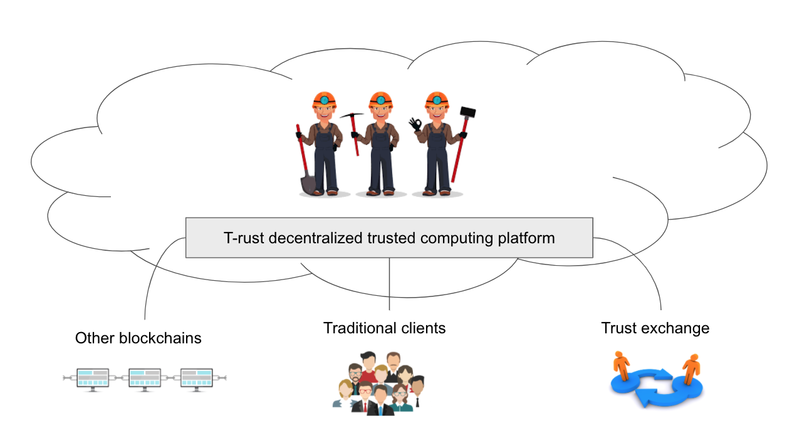
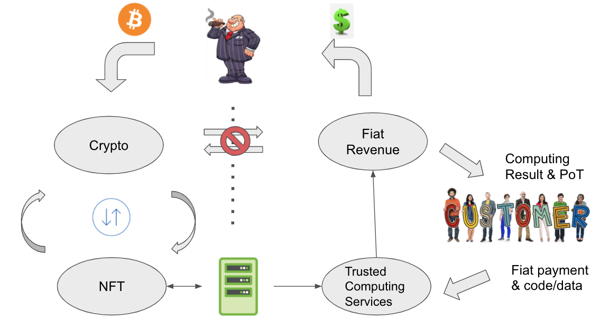
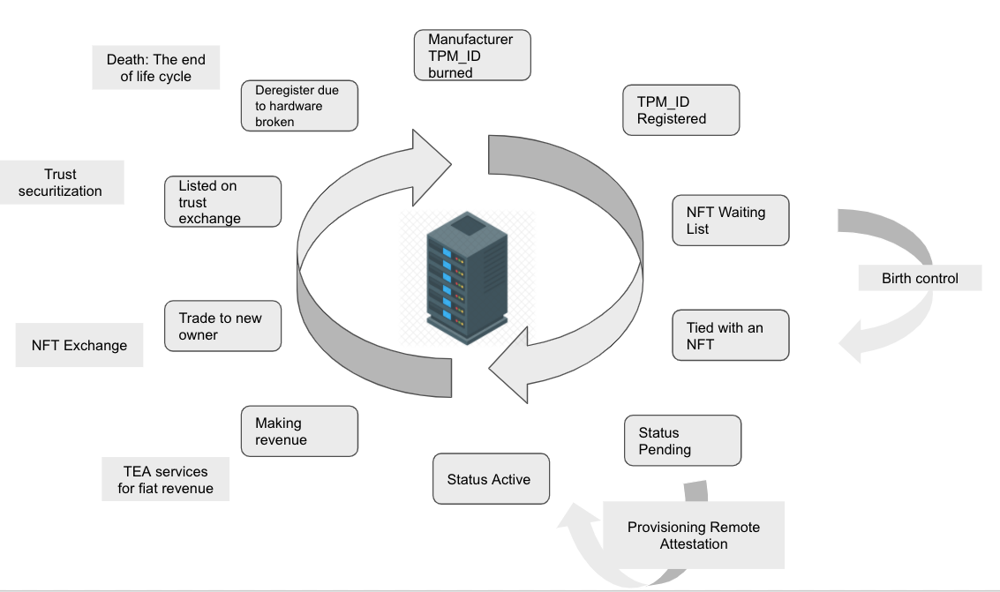

# Uber to traditional taxi companies = T-rust to traditional cloud computing companies 
T-rust is a decentralized trusted computing platform by TEA project. It connects individual trusted servers to provide trusted computing services to general clients. Just like Uber connects individual drivers and cars to provide taxi service to passengers.

Compare with traditional taxi companies, Uber is a great step forward. However, Uber is still a centralized company. Both passengers and drivers know there is a cut to pay to Uber to use the platform even they know they can make a direct deal without Uber. That's because of "Trust". Uber as a middle-man provide trust between passenger and Uber driver. So I can say Uber is selling the "Trust as a Service".

If there is a solution to build trust between passenger and driver in a decentralized manner, there won't be a need for Uber in the middle. This is exactly what T-rust is trying to do, just not in the transportation business. Instead, in cloud computing.

Assuming Amazon is the traditional taxi company, T-rust is the disrupter to Amazon as Uber to taxi companies. One step further, T-rust is not a centralized company like Uber, it is a decentralized autonomous organization. T-rust doesn't take a cut from the payment as Uber did.

# Decentralized trusted computing services - A Trust-as-a-Service platform

Offload the computing task from a centralized cloud to decentralized distributed servers is not hard. The key is "trust". Just like Uber provides trust as a service between passengers and drivers. T-rust uses modern technologies to build trust-as-a-service between client and servers. The trust is not from a brand name like "Amazon", but technologies.

As shown in the picture above. The servers are owned by their own owners, we call them miners as if they are mining bitcoin. The clients send tasks and payment to the platform. The platform run complex algorithm to find the right miner to execute the task. The result and PoT (proof of trust) were sent back to clients. Clients can easily verify the PoT to know the result is correct and the process is secure. The miners then receive all the payments. T-rust won't take a cut!

Long before T-rust, IPFS has been providing the decentralized file storage service for a while. IPFS doesn't provide security since all content is open. The PoT from IPFS is much easy. Just a hash can verify the content is correct. But computing is much harder. For technologies under the hood, please read [What is TEA?](../What_is_TEA?/README.md) and [Under the hood](../Under_the_hood/README.md).

# [T-rust providers a channel for investors to invest in crypto and gain revenue in fiat](Double_loop.md)

T-rust has a specially designed double-loops. It segregates the cryptocurrency loop and fiat currency loop. There is no exchange between crypto and fiat so that prevent any crypto-related legal issue. Furthermore, it provides a way to invest in crypto while gaining revenue in fiat.

Investors pay crypto (such BTC) to invest an NFT (Non-fungible token). Every NFT ties to a physical mining machine. This mining machine joins the T-rust to running trusted computing services to clients who pay fiat as service charge. The fiat revenue returns to the investor as ROI (Returns on invest).

The NFT's values are the profitability of the mining machine. Every mining machine is unique. Its credit history and performance history determine how much revenue it can generate. The investor can sell the NFT for crypto in TEA exchange for capital gain if the value goes up.

The NFT can be sold in whole or in shares. This is called Trust Securitization. That means you can buy a share of a profitable NFT as if it is a stock of a company.

Buy and sell an NFT doesn't need to physically relocate the mining machine. It is still where it was. Just the ownership and profit account directly to the new owner.

This is a new way to invest your crypto while earning fiat legally. This business model is exactly the opposite of Bitcoin mining, which spend fiat to buy machines and pay utility then min crypto as revenue. Bitcoin machines depreciate very fast but T-rust mining NFT is supposed to increase in value because of the credit gains over time.

Detailed explanation is [here](Double_loops.md)

# [Life cycle of a NFT->Mining machine and social mobility](life_cycle.md)

A community-driven project is just human society. A healthy society needs [social mobility](https://en.wikipedia.org/wiki/Social_mobility). Otherwise, the existing old members will occupy all leading position and control the rules so that new join nodes won't get chance ascending. To prevent this, we introduce the life cycle just like human-being. All human will die eventually, it sounds cruel but it is how human being revolution. The TEA node, refer as NFT, will die too. Over time, the machine will break or obsolete due to ageing. We do not allow the credit of a dead TEA node to transfer to a new TEA node even if they are owned by the same owner. When a tea node dies, the credit is gone as well.

This is a diagram of a TEA node's life cycle. The detailed explanation is [here](Life_cycle.md).

# [Birth control](Birth_control.md)

Death of any existing TEA node is out of control, but the birth rate is carefully controlled by layer 1 smart contracts.

Just like the Bitcoin automatically adjust difficulties based on block rate. T-rust will adjust the birth rate based on the overall workload of existing T-rust nodes. If there are too many tasks in the waiting list that cannot be processed for a while, the birth rate will increase. More new nodes are allowed to join the T-rust. On the other side, if many TEA nodes are idle waiting for tasks for a while, the birth rate will decrease to protect the profitability of existing nodes.

[Read details](Birth_control.md)
