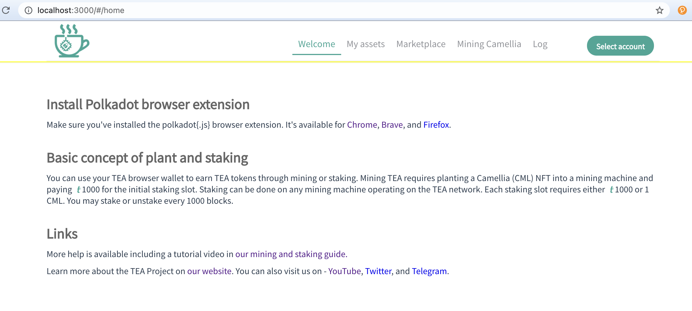

## Running the Wallet
You currently have 2 options for running the TEA browser wallet:

1. **Remote.** You can access the browser wallet using a remote host. We will eventually be remotely hosting the client wallet at [wallet.teaproject.org](https://wallet.teaproject.org). It is currently accessible at either http://198.199.82.222/ or http://68.183.182.174/ 

2. **Local.** The TEA Project is decentralized, allowing you to run the browser wallet locally on your machine without the aid of any central servers. 

- To get started, you should first have Node.js installed on your computer. The [official repo](https://nodejs.org/en/download/) should be sufficient for most users, though [Windows](https://github.com/coreybutler/nvm-windows) and [Mac](https://formulae.brew.sh/formula/node) users might wish to install using a package manager. Just make sure that the Node version is greater than 14.

- Visit https://github.com/tearust/tea-browser-wallet/ and download the repo:

Unpack the zip archive.

- Start the browser wallet. From your command line terminal, run the following two commands when in the downloaded **tea-browser-wallet-master** folder :

`npm i`

`npm start`

- You should now to be able to access the browser wallet using localhost with the given port in your web browser:

You can use either [localhost:3000](http://localhost:3000) or [127.0.0.1:3000](http://127.0.0.1:3000)