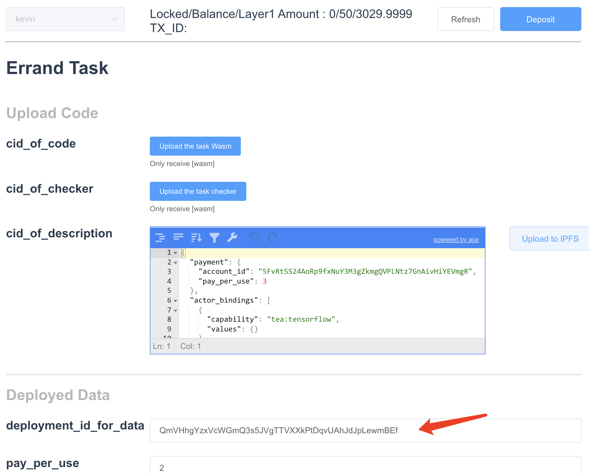

# Deploy your picture and run the same Tensorflow function to detect image
In our first easy start demo. You run an existing dApp to detect a pre-deployed image using Tensorflow algorithm. 
Now you can try to deploy your image and use the same algorithm to detect.

To learn more about what is ad-hoc, please go to [Advanced demo](Advanced_demo.md).

# Deploy your image
Click <a href="t-rust.com:8080/ipfs/QmY2rEeBf325KhCiNsKrsi8EUZDqiEMxarfUmCRQir6HRY/">Data dpeloyment tool</a> to start. If you are behind the China Great Firewall, please use the [Chinese local IPFS server IP](http://81.70.96.136:8080/ipfs/QmY2rEeBf325KhCiNsKrsi8EUZDqiEMxarfUmCRQir6HRY) instead.

The first step is very similar to the Easy Start demo dApp. You will need to select a delegator node. If you have your TEA node, you can choose it from the lower table. If you do not, you can choose any of the four bootstrap nodes in the upper table. In our screenshot I selected Bob.

You can click "Upload the data image" and upload your local image to the delegator node.
If you do not have an image, please download any pre-made test image from below.

All these images are tested working with Tensorflow algorithm.

Once you selected the image, now select account. This step is the same as what we did in Easy Start demo. 
The description is how you price your data. In TEA network, users own their data, not the service provider. You can list a price model such as "pay per use". However, use your data (reference your deployment_id) to run any algorithm need to pay you the price you listed here. You can get revenue from offering your valuable data to others. The privacy is protected by hardware and cryptographic algorithm. 
We can keep the price as-is for now. Just click next to continue.

This page is the last. Your data has been deployed with the deployment_id in the red box. Please copy and paste the deployment_id somewhere. This id represents your data in the TEA network. However, I would like to use your data needs to reference this ID. You will need it in the upcoming step.

The deployment is a life-long process. But after a few seconds, you can click "Find provider" button and "Refresh" button to see who has "pinned" your data. 

In the screenshot above, you can see there are four nodes "pinned" your data. All those four nodes are "pinner" of your data deployment. This means if someone needs to use your data need to get the detail from one of those pinners. Of course, they get paid too for offering such repin service. 

# Run demo dApp with pre-deployed data

Please keep the previous browser tab open and open a new tab then launch the [Deployed Data dApp Demo](http://t-rust.com:8080/ipfs/QmdZXJFVuoSSx8q8aiU8i2mhsoPe27DbQY9mZ5WJCtxZEM). If you are behind the China Great Firewall, use this [local ipfs address](http://81.70.96.136:8080/ipfs/QmdZXJFVuoSSx8q8aiU8i2mhsoPe27DbQY9mZ5WJCtxZEM) instead.

The first page is the same as before, but you do not have to select the same delegator node as you did when deploying the data. You can select any active node. When you get the confirmation from the delegator, you will see the page below.

Pay attention to the deployment_id_for_data input box pointed by the red arrow. You will need to replace this value with the deployment_id you got in the last step when you were deploying the data. When executed, the images referred by this deployment_id will be loaded into the executor. 

Besides that, I also need to make sure you have enough deposit. If not, transfer some fund to this delegator especially when you choose a new delegator who doesn't owe your deposit before.

Now you will need to upload your code which runs the deployed data. In our demo, it is a Tensorflow image recognization function. Please upload both the function wasm and the cap checker wasm. The cap checker is used for a node to check its capability before it can provide such a service (pin the code). You can also edit the JSON description if you want to modify the payment structure. Do not forget to click "upload to ipfs" at the end.

When everything is done, run the task. You should see the result. 

