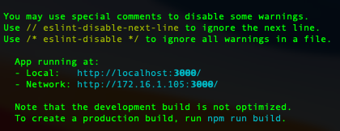

  # Using the Mining Wallet - Preview 1
The mining wallet is accessible at [http://68.183.182.174/](http://68.183.182.174/).  

Here is a video tutorial for using the wallet in the preview stage:
<iframe width="560" height="315" src="https://www.youtube.com/embed/YneSF3ltxCg" title="YouTube video player" frameborder="0" allow="accelerometer; autoplay; clipboard-write; encrypted-media; gyroscope; picture-in-picture" allowfullscreen></iframe>

Below are the steps described in the video in more detail.

## Preparing Your Wallet
- [Install the Polkadot Browser Extension](../FAQ/Installing_Polkadot_Extension.md)

- [Creating a New Wallet Account](../FAQ/Creating_a_New_Wallet_Account.md)

## Running the Wallet
You have 3 options for running the TEA browser wallet:

1. **Remote.** You can access the browser wallet at the remote host http://68.183.182.174/
2. **IPFS.**  _IPFS CID_
3. **Local.** The TEA Project is decentralized, allowing you to run the browser wallet locally on your machine without the aid of any central servers. 

- To get started, you should first have Node.js installed on your computer. The [official repo](https://nodejs.org/en/download/) should be sufficient for most users, though [Windows](https://github.com/coreybutler/nvm-windows) and [Mac](https://formulae.brew.sh/formula/node) users might wish to install using a package manager. 

- Visit https://github.com/tearust/tea-browser-wallet/ and download the repo:

Unpack the zip archive.

- Start the browser wallet. From your command line terminal, run the following two commands when in the downloaded **tea-browser-wallet-master** folder :

`npm i`

`npm run start`

- You should now to be able to access the browser wallet using localhost with given port in your web browser:

## Sign Up For CML Seed Coupons
You will need the TEA Project's NFT known as Camellia (CML) to start mining on the network. Fill out the [investor registration form](https://docs.google.com/forms/d/e/1FAIpQLSdNyJVmRjyYImTtTJ3AEzk8y6s3ZfCnoxMEzfbyYi_vVdIIzg/viewform) to sign up for redeemable seed coupons. You'll be able to select how many A / B / C coupons you want (up to 5 of each group).

Testers will be able to see their CML coupons in their tea wallet when the new epoch starts.

## Steps to Start Generating TEA Yield
      
For this early preview stage, we have a faucet to top up your TEA tokens. It’s quite generous for now at 100 TEA, but it will eventually become a legitimate low-emission faucet that only gives .01 TEA. The point of the faucet is to cover transaction fees for those new to the platform.
      
### Mining TEA
The two ways to generate TEA are either to mine or to stake. To begin mining, you would plant a CML seed into a TEA mining machine to generate TEA tokens. These machines are all virtual for right now, merely simulated machines in place of real miners. Look for the little icon here in your CML seed's row to plant your seed into a miner:

The miner ID & IP will accept anything at this stage (again, these are imaginary machines):

### Staking TEA

Staking is a method of generating revenue without requiring the user to have a mining machine. Some people lack the knowledge, capital, or patience necessary to run a mining machine. Others may have TEA tokens but lack the CML NFT necessary to start up a mining machine. 

Users can stake either 1 CML or [//TEA]1000 per staking slot. To start staking, select the "Mining Camellia" link in the header. Click on the **Stake** button for any miner you want to stake with:

You can either select one of your non-staked and defrosted CML for staking, or leave the CML unselected and the system will automatically take [//TEA]1000 for your staked amount. The slot index is a slippage tolerance setting and can be safely ignored for now:

