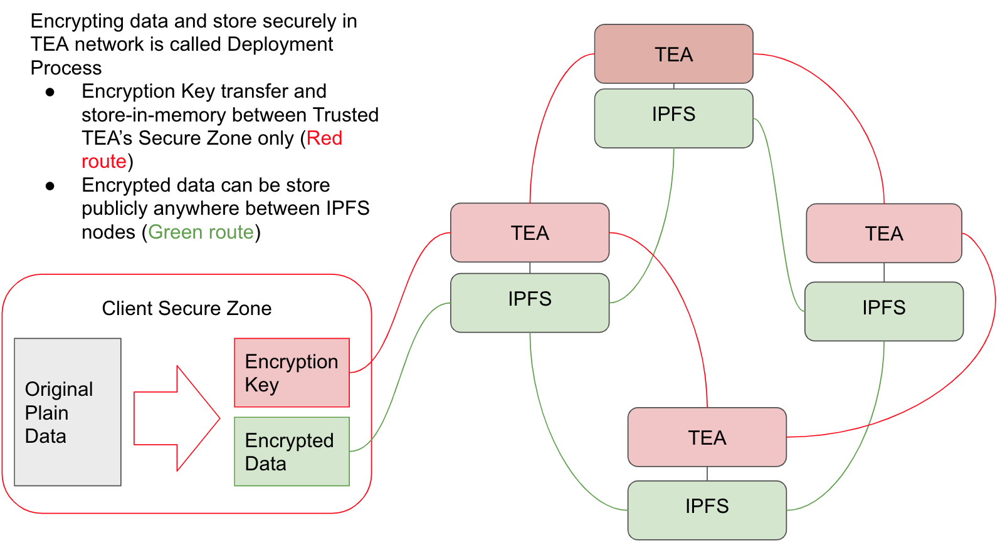

 ## This Front Section Probably To Be Reworked Into Litepaper
 
The TEA Project is able to achieve its computational speed by on its layer-2 by leveraging the trust of its layer-1. Byzantine fault tolerance (BFT) requires blockchains to continually inspect nodes for signs of bad actors. Circumventing slow processing speeds inherent with BFT is an endemic problem of decentralized systems. TEA's layer-1 blockchain still uses Byzantine fault tolerance. The longer times needed to reach consensus on TEA's layer-1 won't interfere with the faster speeds required on its layer-2. The TEA network only needs to use the Proof of Trust (PoT) data on layer-1 to reach a consensus on the trustability of nodes on layer-2.

In the TEA Project, dApps run Web Assembly code on layer-2 within hardware-protected enclaves. TEA's root of trust comes from miners' hardware that forms the distributed nodes of the TEA network. Each mining machine has an embedded TPM chip that generates PoT data. This PoT data is stored on TEA's layer-1 blockchain. The beauty of this setup comes from the layer-1 trust data that TEA mining nodes can poll to reach consensus. 

The current state of every dApp running on the TEA network is maintained through a state machine that orders transactions using Proof of Time. Using time as a root of trust allows dApps to query the current state through the nearest node that works like a database tier from the app's perspective. Not only are TEA Project dApps fully decentralized, but they can also run full speed (thanks to the layer-2 nodes' protected execution enclaves) and can query a database layer (thanks to the layer-2 nodes' GPS modules).

## End of Litepaper section

TEA stands for **T**rusted **E**xecution and **A**ttestation. The TEA Project uses consensus not to confirm the result of the dApp's code; it instead uses consensus to verify the execution environment where the code was run. The TEA Project's philosophy is that **if the execution environment, code, and input data are trusted, then the execution result can also be trusted.**      

 
TEA uses its layer-1 blockchain to provide:

 - Economic incentives and penalties that form the basis of its token economy.
 - Immutable trust information storage, such as credit history (incentives and penalties for nodes governed by smart contracts) as well as Proof of Trust information.
 - Block height as a universal clock between TEA nodes.

## Sources of Truth: Blockchain and Hardware

The TEA project relies on three souces of trust: the blockchain, hardware, and GPS satellites.

Every node stores its essential data to the blockchain. Based on the blockchain's secure nature, the data stored in the blockchain is considered trustable. When performing remote attestation, the verifier won't trust anything the testee claims; everything needs to come from either the historical data in blockchain or the hardware signed message. All other decisions are made based on those two sources of truth. 

The TEA Project can use trusted execution environments like Amazon's Nitro or a hardware security module (HSM) like TPM as a source of trust.

The validation is centralized for Amazon Nitro, so no further consensus is required.
- For hardware security modules like TPM, there are still known vulnerabilities. Since TPM alone is not secure enough, a delegation chain is created on the network for a remote attestation workflow. 

## The Delegation Chain Builds the Trust Chain
The delegation chain is a network protocol between each TEA node's HSM to transfer trusted computing tasks securely. It uses multiple parties to conduct remote attestation to ensure that data is only transferred among verified trusted hardware modules.

-   A client sends secure data or code to a trusted TEA node as a delegator. If the client doesn't trust any other nodes, they would be best served to own a TEA node to act as a delegator for their own data or code.
-   A delegator will be looking for qualified executors among all the TEA nodes in the IPFS p2p network. Remote attestation is done between each node before exchanging any sensitive information
Data or code will be transferred via a **repin** to a new delegator (called a **pinner**) to host or an executor to run.
-   No matter where the data or code goes, the proof of delegation (PoD) data will be attached at each step, forming a delegation chain.
-   Anyone can verify the delegation chain to ensure the chain is valid. Any hacks in the middle would be easily discovered via the blockchain.
-   TEA's layer-1 blockchain will be used to do the verification. Any incentives or punishments is then applied to the participating nodes.

## The Trust Chain Provides Trust Data to Layer-2
The trust chain starts from the hardware-based trust data (from hardware security modules like TPM) that are stored in the layer-1 blockchain. The trust chain connects the Proof of Trust data up to the layer-2 nodes running the WASM code.

## Further Reading
- https://teaproject.org/How_TEA_Fixes_the_Internet.md#/doc_list/Under_the_hood%2FDelegation_chain.md
- https://teaproject.org/How_TEA_Fixes_the_Internet.md#/doc_list/Under_the_hood%2FRepin.md