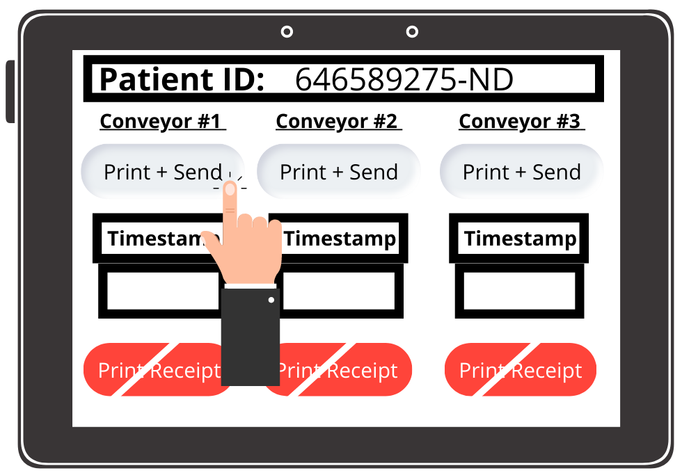
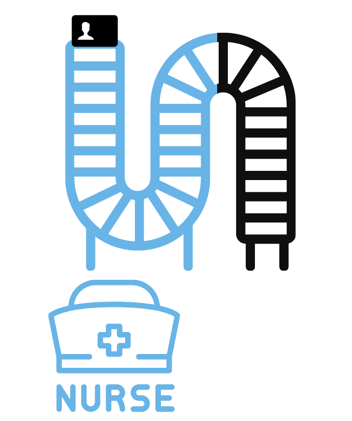
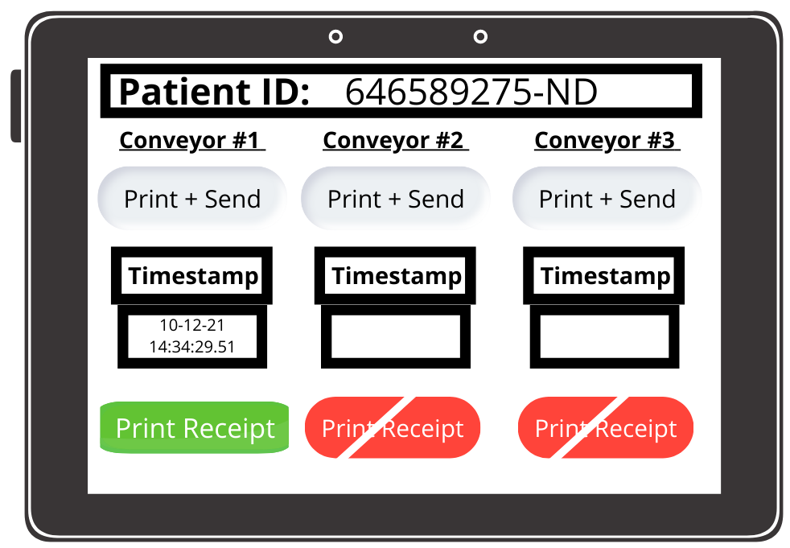
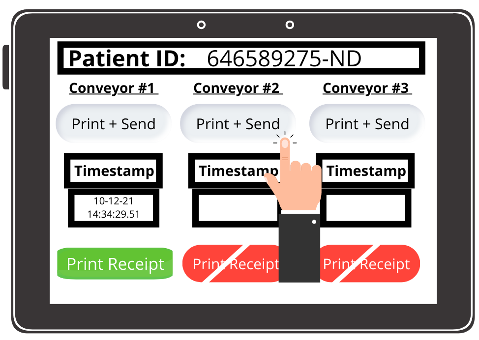
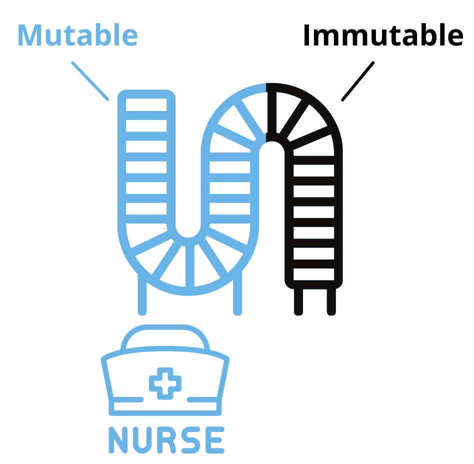
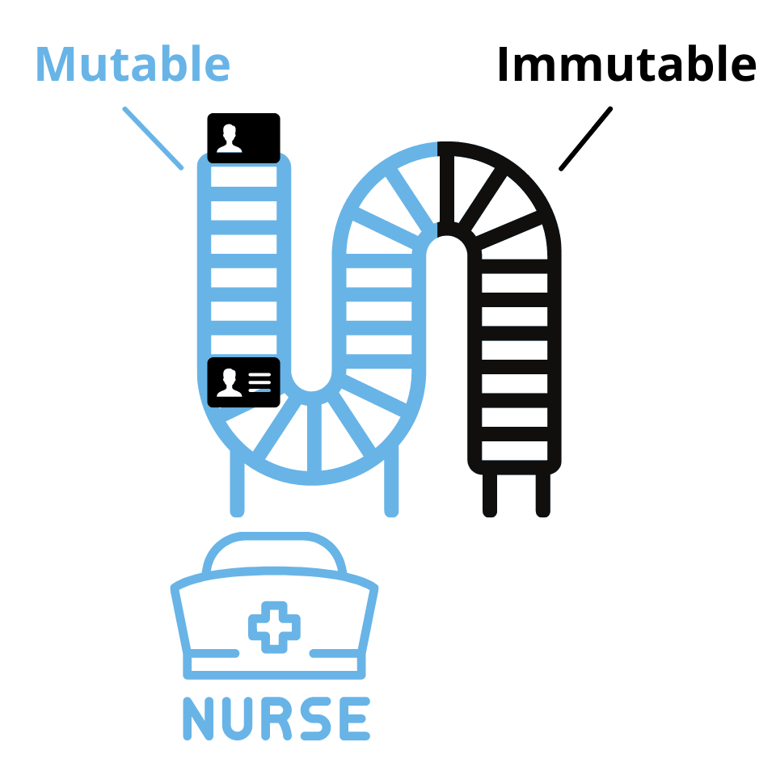

      

To illustrate the TEA Project’s layer-2 consensus, we’ll use the analogy of a hospital that needs to do patient intake evaluations as they enter the hospital clinic. The patients are assessed by a doctor and then go sit down in the waiting area for them to be seen. At the same time, an index card with information about the patient is printed in duplicate and sent into 3 different conveyor belts. There’s 1 main conveyor belt along with 2 backups running alongside of it (for HIPAA compliance). The order of the cards needs to be the same as the order as when the patients came in for treatment. This is a standard triage process but also rearranging the order in which patients are processed for treatment could end up making the hospital liable for bias charges.

We also assume that all doctors, nurses, and hospital staff are all honest. In crypto terms, there’s no possibility of a Byzantine Fault. The operations described in this hospital story helps illustrate the TEA Project’s layer-2 consensus, but the operators acting in this layer are proven trustable by the Proof of Trust data on layer-1.

Let’s take an in-depth look at how this hypothetical hospital clinic handles keeping patient treatment cards in the same order relative to when they came in for their assessments.

## Doctor: Does Assessment, Sends Duplicate Index Cards & Receipts to 3 Conveyor Belts

Each patient is assessed by a doctor in the order they arrive. The doctor enters their vitals into their iPad the following: 

  
- The patient’s ID number
- The patient’s name
- Height
- Weight
- Blood type
- Allergies
- Symptoms to be treated
- Diagnosis and prescription for treatment.

The doctor writes this information out onto an iPad. When done, they’ll print the index cards directly onto the nurses’ conveyor belts. Since the doctor can’t push push two buttons on their iPad for two different conveyor belts at the same time, the send times on these patient index cards will all have slightly different timestamps.

The timestamps of when these index card were sent on the nurses’ conveyor belts must be noted for HIPAA compliance. For the hospital to remain compliant, it notes these timestamps on followup receipts. The doctor has another button to send these receipts onto the nurses’ conveyor belts as they will help the nurses determine the ordering of the patient cards.

## The Doctor’s Job: Write Patient Assessment + Print and Send Both Index Cards & Receipts

After the doctor has finished writing the patient’s initial assessment, they send their evaluation to the nurses’ conveyor belts where various hospital staff can prepare the doctor’s prescription for the patient. Here’s what the doctor’s iPad looks like after they’re done writing the patient’s evaluation:
  

We see the **Patient ID** which uniquely identifies the patient in the hospital system. There are three columns each corresponding to one of the conveyor belts.

Once the doctor clicks **Print + Send** in any conveyor belt’s column, three things happen:

1. The patient’s index card is printed and sent to that particular conveyor belt.
2. A timestamp of when that card was sent on that conveyor belt is noted in the timestamp box.
3. The red **Print Receipt” button, which is not selectable, turns green and is now selectable. In other words, the **Print Receipt** button only becomes operational for a conveyor belt after the index card has been printed.

Let’s visually go through this process as the doctor begins by clicking **Print + Send** in the **Conveyor #1** column.

Clicking that button prints out the patient’s index card onto conveyor belt #1 and starts moving.

 

The timestamp of when this index card was sent is added to the display, and the **Print Receipt** button for that column becomes active:

  

The doctor can now print a receipt for when they sent the patient’s index card on conveyor belt #1. If he clicked **Print Receipt** now, it would print a receipt onto conveyor belt #1 with the patient ID and the single timestamp of when it was sent to conveyor #1, **10-12-21 14:34:29.51**.

To help show how receipts work, let’s imagine that the doctor next clicks **Print + Send** in the **Conveyor #2** column:

 

This prints the patient’s index card to conveyor belt #2 and generates a **sent** timestamp for that conveyor belt that’s recorded in the appropriate column:

   

If the doctor decides to click **Print Receipt** on this second **Conveyor #2** column, it will print a receipt out onto conveyor belt #2 with the following data:

-   **Patient ID**: 646589275-ND
-   **Sent to Conveyor #1**: 10-12-21 14:34:29.51
-   **Sent to Conveyor #2**: 10-12-21 14:34:32.75

The receipt itself will have a timestamp but, like a grocery receipt also has a timestamp, it’s not important for the hospital operations as HIPAA doesn’t require tracking the timestamp of the receipt.

## Variability with Doctors Sending Patient Index Cards

Every doctor is different in how they send in patient assessments. This can affect the number of patient index cards and the number of receipts that are printed.

- **(possibly only once?)** There may be times when a doctor is absent-minded or in a hurry and doesn’t push **Print + Send** for one of the conveyor belts.

- Note that here are a max of 3 total receipts but there could be less than that. HIPAA compliance requires only one receipt for every patient’s index card, so the doctor will sometimes only push the **Print Receipt** button. Even though this is technically not by-the-book procedure, everyone understands that the hospital can get very busy and sometimes less than 3 receipts will be printed for a patient’s index card. So the doctor will sometimes only print just 1 or 2 receipts to achieve HIPAA compliance.

Doctors have their own idiosyncrasies and will push the buttons according to what feels natural to them.

- Some will click **Print + Send** and then click**Print Receipt** for each conveyor belt.

- Another doctor might prefer to click **Print + Send** for conveyor belts 1, 2, and 3 before then clicking **Print Receipt** for each conveyor belt.

- Some will be much more loose and mix **Print + Send** with clicking the **Print Receipt** button. The only requirement is that the **Print + Send** button must be pressed for a conveyor belt before the **Print Receipt** button for it becomes active.

 
Just like in real life, it’s up to the nurse to deal with the doctor personality quirks and mixups and to make sure that the patient index cards are in the correct order.

  
## Nurses job: keeping the Index Cards in the Same Order as Patient
Nurses responsibility:

1) Match receipt with index cards. Although the index card might seem like enough, HIPAA regulations require this hospital clinic to have both the original index card and the receipt of when it was sent in order to treat the patient. If it is missing either of those, the hospital can not treat the patient.

There’s a max of 3 total receipts across all 3 conveyor belts but there could be less than that. 

2) A nurse only works in the blue mutable area of the conveyor belt (see image below). As the conveyor belt is constantly moving, the nurse has 10 minutes to rearrange the index cards pairs according to the earliest timestamp on the receipt. 

 
  
On a practical level, here’s how it looks like for a patient index card that has been placed on the conveyor belt without any receipt data attached (I.e. the followup receipt hasn’t been received yet on that conveyor belt) versus a patient index card that has receipt data attached: 

 
  
Nurses make decisions on new receipts and index cards entering the conveyor belt. 

-   When a new receipt arrives, she checks the patient ID # on the receipt and attaches it to the index card if the index card is still in the mutable area. If not, the receipt is left on the conveyor belt in case it has arrived before the index card. (is this possible?) If receipt reaches end of mutable area of conveyor belt and patient’s index card still hasn’t arrived, then it’s discarded.

- The index card and receipt both have to be on the mutable area of the conveyor belt by (earliest timestamp of when index card was sent, as shown on the receipt) or (when index card was received) + 10 minutes, otherwise HIPAA compliance means they will be discarded if either the patient index card or followup receipt is missing.

-   Once a patient index card is joined with its receipt and is still on the conveyor belt’s mutable position, it’s positioned based on the earliest timestamp on the receipt. 

The nurse’s job is to keep the index cards ordered in the correct position based on the earliest timestamp of the receipt corresponding to each patient’s index card. They have to reconcile the positions with new receipts constantly being added to their conveyor belt. The nurse only has jurisdiction over the cards from the time they enter their conveyor belt to the point it leaves the mutable area, which in this example is 10 minutes.

## Hospital Coordinator: Keep Order Between the Conveyor Belts 

A hospital coordinator sounds like a fancy title, but their job is low-paid grunt work with very little capabilities for them to perform. With that said, they perform a very important function for maintaining the proper order of the patient’s cards. 

A coordinator’s job focuses on both the mutable area of each conveyor belt (in this example, index cards stay in the mutable area for 10 minutes) and the immutable area afterwards which is off limits to the nurses (patient cards stay here for 5 minutes). The immutable area of the conveyor belt is an area where nurses can no longer make changes to the order of the patient index cards.

There’s only one job for the hospital coordinator to perform:

-   The coordinator constantly checks each conveyor belt in both the immutable and mutable areas.
-   If the coordinator notices there is an index card missing from one of the conveyor belts, they can print it out on the spot (using a handheld printer) and add it to that conveyor belt.
-   The coordinator can only add, it can’t take away any cards.