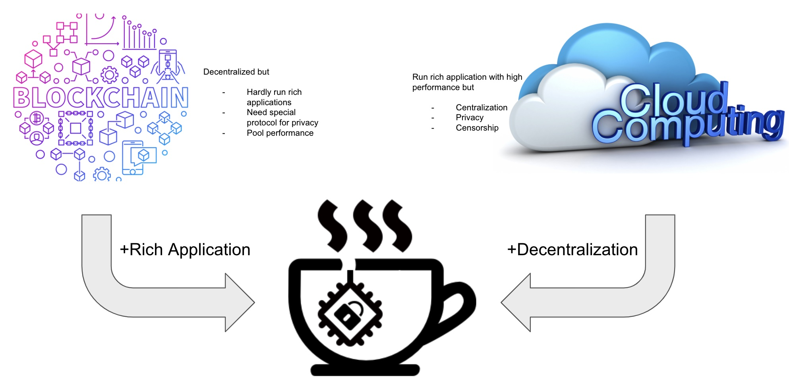
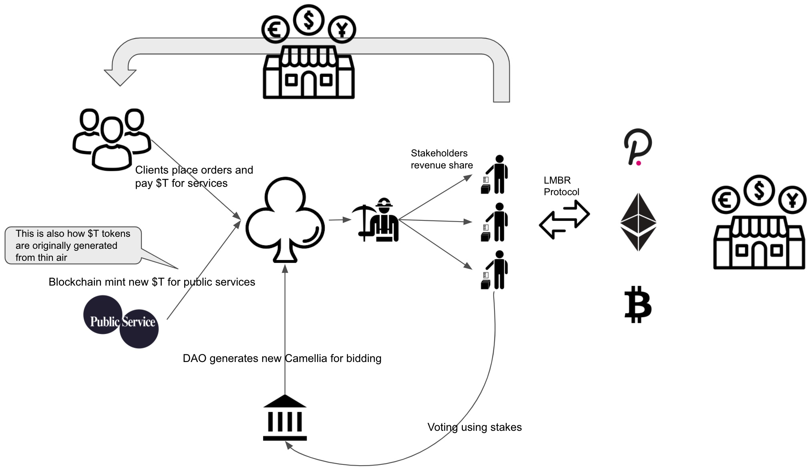
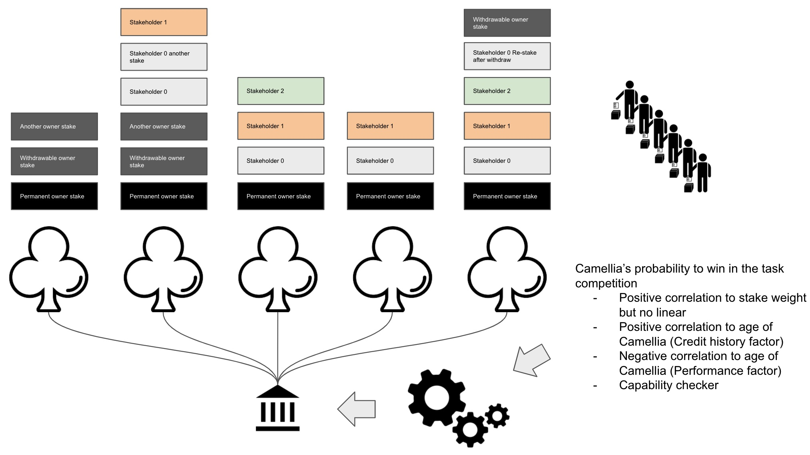
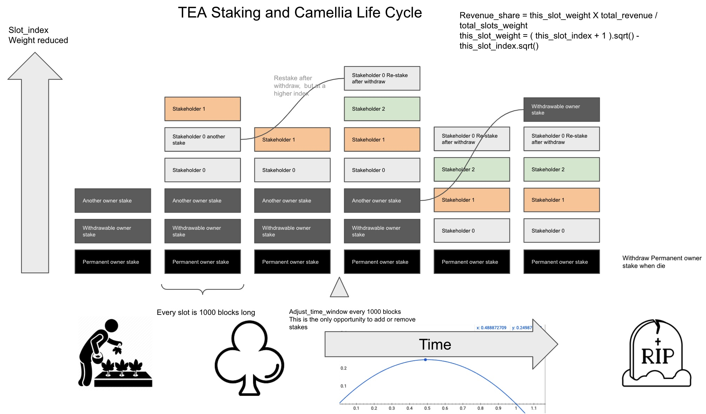

# T 计划的一句话简介

T 计划(the TEA  Project)是一个构建在区块链上的二层方案. 其目的是进行硬件保护可信下的去中心化云计算. 它可以为其他区块链的智能合约提供 Off chain 的复杂高成本的计算服务, 也可以在上面构建接近于现有云计算复杂程度的去中心化应用. 

可以把 TEA 看做是 Uber for cloud computing, 因为 TEA 自己不拥有并运行任何服务器, 而是茶农矿工自己配置 TEA Node 接入 TEA 网络并在区块链协议 Proof of Trust 的严格管理下为其他区块链客户提供可信计算服务, 而且天然就是完全去中心化的.

# TEA: Trusted Execution and Attestation

TEA 是英文 Trusted Execution and Attestation 的首字母缩写. 含义就是可信地执行和验证. 让代码在可信的执行环境中运行而且这个可信可以被第三方进行验证. TEA 正好是英文茶叶的意思. 所以 TEA Project 中的很多概念都沿用茶叶相关的词汇. 比如 PoT (Proof of Trust)正好是茶壶. Camellia 是茶树的意思等等. 

# TEA Project 的基础技术知识极简版本

TEA Project 是一个底层技术项目. 涉及的技术细节比较深奥. 有兴趣的可以去看技术白皮书. 在这里我们列出以可以读懂本文的代币经济学设计为目的的基础知识. 

TEA 是一个介于传统区块链和 dApp 之间的可信计算层. 它扩充了现有区块链的两个信任根: 共识和密码学, 增加了一个硬件信任根. 这样使得 dApp 可以把昂贵和复杂的计算从区块链上挪到 TEA 这个 Layer2 上. 从而提高效率降低成本, 完成了以前无法进行或者无法承担的计算工作而并没有丧失安全性. 大致可以认为是云计算的去中心化改进或者区块链的硬件加速器.

TEA project 中也包含一个区块链的底层叫 Layer1, 不过这个 layer1 不是运行 dApp 的智能合约, 而是运行对 Layer2 的安全审计. dApp 的计算逻辑(俗称智能合约)是跑在 Layer2 的可信计算硬件, 也就是矿工的矿机上的. 通过可信硬件和区块链的共识让矿工无法作恶, 从而实现可信安全和隐私保护的去中心化计算. 

TEA project 除了底层基础链和二层协议之外, 还包括一些基础的金融应用, 比如信用局, 钱包,交易所, 抵押铸币等. 更多的应用需要社区开发者逐步参与和支持开发.

因为本文主要专注在代币经济学设计. 至于为什么 TEA 可以做到可信, 请参考更加详细的 TEA 技术白皮书中的阐述.

# T计划的两种代币

TEA Project 有两种代币. TEA (茶叶)和 CML(Camellia 茶树).

TEA (茶叶)是稳定币, 其币值恒定为可以计量的计算资源. 比如 CPU 计算指令数量, 网络传输字节和存储大小时长. 在任何时候, 同样数量的TEA 都可以用来支付在 TEA 平台上完成同样一个规模的计算任务. TEA 的总数不设限. 随着计算资源的消耗而增发. 也就是说全网计算规模越大, TEA 的数量越多. TEA 是一个标准的 Utility Token.   

CML (茶树)是非同质化权益币. 茶树是用来生产茶叶的. 它代表的是挖矿资格和能力. 同时茶树也是 DAO 成员参与管理的投票权重. 每一颗茶树都是不同的 NFT, 它有自己的生命周期, 品种和信用历史. 这些属性是分配计算任务的算法的输入参数. 不同种类的茶树, 同一个茶树在生命周期的不同时段是具有不同的盈利能力的. 正式由于这种差异让茶树的价格存在区别. 茶树的总数由 DAO 的生育控制和种子拍卖进行自我调节. 这种稀缺性和随生命周期的价格波动为投机茶树提供了机会.

# 茶叶的商业循环

TEA（茶叶）是整个 T 计划的燃料. 来自最终用户或者其他 dApp 的计算任务用 TEA 茶叶来计算价格并支付. 支付的茶叶根据算法分配给参与提供服务的茶农(别人都叫矿工. 我们更环保, 所以叫茶农. 在本文中茶农和矿工两个词语是混用的).这些茶农的收益还要根据预定的分配机制分享给身后的地主(也就是锁仓茶叶投资给茶农的投资者).

除了有人支付茶叶的商业任务之外,还有为全网的公共事务的计算任务, 这些叫做公共服务. 这些公共事务主要包括随机的安全审计, DAO 管理以及全网技术保障等. 这些公共服务的茶叶是由DAO 增发茶叶来支付的. 这也是最初茶叶产生的机制.

茶叶由 DAO 增发也由 DAO 销毁. 也就是俗称的烧掉. DAO 烧掉茶叶包括:

- 茶树拍卖所得的茶叶被烧掉
- 茶农作恶被检举确定后, 其茶树和抵押的茶叶, 也包括地主锁仓投资的茶叶都会扣除检举奖励后烧掉

茶叶的总数并不恒定, 而是在新增和销毁两个此消彼长的过程中不断自动调整. 总体来说随着计算规模的扩大和客户需求的增加, 茶叶的总数会增加来适应市场需求. 但是如果经济萧条, 茶叶总量会减少从而保护价格体系. 这种调节是算法加上DAO 管控共同完成的. 

茶叶除了作为燃料进行流动之外,还可以用于投资. 其做法是地主锁仓(Staking)给茶农的茶树让茶农劳动代为产茶并分享收益. 由于茶树的 NFT 造成的个体差异和生命周期的变化, 投资茶叶给茶树这件事儿本身也会产生竞争和风险. 

## T$ 的产生和分配

TEA是代币的 Ticker,可以简写成为 `T$`, 这是一种 Utility Token.
在创始区块中不会包含任何创始 TEA 分配给团队或者早期投资人. 所有的 TEA 都是需要通过挖矿来得到.

### 获得 T$的方式

有以下方式可以获得 `T$`

- 矿工为用户提供可信计算服务获得用户支付的 gas和小费 tip
- 矿工为 TEA 内部的公共服务提供计算服务获得 DAO 增发的 TEA
- 任何人通过金融交易获得
- 通过锁仓投资给茶树的投资人获得收益分红

### `T$`的增发, 销毁, 总量和价格锚定

`T$` 没有总量恒定. 它的增发来源于公共服务产生的计算成本. 只要有用于全网公共服务的计算资源消耗, 就会有等量的 TEA 被增发出来被参与公共服务挖矿的矿工按照工作量比例分配. 当然需要区别开来的是当矿工为客户服务进行的计算消耗是客户支付 TEA 作为 Gas 而不是通过系统增发. 

随着网络规模扩大或者减小, 公共服务的资源消耗也会增加或者减少, 因此增发的 TEA 速率是随着网络规模上下浮动的. 在经济好转的时候, 更多矿工加入挖矿, 公共服务负担加重, TEA 增发速率加大. 反之当经济变差的时候增发速率会降低.

相对应于公共服务持续增发 TEA,另外的一个反向操作就是把拍卖茶树苗所得的 TEA 和违规罚没的 TEA 进行销毁来减少 TEA. 因为增发和销毁会同时存在, 所以长期来看 TEA 随着经济规模和竞争态势自动总量调节的Token.

由于计算的定价是客观的根据计算量来衡量(比如 CPU 指令, 占用时间, 网络流量或者存储大小和时间等),所以 TEA 是用计算成本锚定的稳定币. 

### 公共服务奖励和分配

公共服务是指维护系统可信而进行的节点安全审查, 出块, 代码维护和系统管理支出. 这些开销无法找到具体的支付对象, 获益者是全体社区. 所以定义为公共服务.

公共服务的开销通过每个区块凭空产生的新代币来根据为这些任务发生的计算消耗来进行分配. 在系统初期主要是出块服务和根据安全审查消耗的计算资源, 未来也许会增加各种 DAO 内部管理开销.

在TEA 可以进行市场交易或者提供计算服务之前, 为公共服务挖矿是唯一获得 TEA 的方式.

## T$的交易, 和 ERC20 的 Lock&Mint , Burn&Redeem (LMBR) 协议
`T$`是在 TEA 网络内部的代币. 自身不是发行在 Ethereum 上的 ERC20 代币. 因此不能直接转移到 ERC20 兼容的钱包或者交易所进行交易. 但是 TEA 提供了 Lock&Mint and Burn&Redeem Protocol 可以通过锁定 TEA Network 上的代币获得 1:1 等值的 ERC20 Token t.eth.这个代币是标准 ERC20 代币, 可以在任何支持 ERC20 的 Defi 系统上进行各种金融交易. 如果交易完毕希望赎回原先锁定的`T$`, 则需要进行一次 Burn 操作, 然后原先的 TEA 代币会返回. 除了交易费之外没有其他金融损失. 
同样的做法适用于其他支持智能合约和多签的区块链, 比如 Polkadot 的 t.dot token

## 未来 TEA 上面建立的各种 Defi 业务

TEA 属于一个区块链基础服务平台. 未来随着生态的开展, 上面一定会产生各种 Defi 应用. 这些 Defi 应用可以直接调用 TEA 提供的可信计算服务, 从而完成传统的区块链无法达到的高吞吐和低 Gas 费. 这些 Defi 因为是构建在 TEA 之上的, 因此就不需要进行 ERC20 转换即可直接处理. 如果需要处理 ERC20 兼容的外部代币,可以使用同样的Lock&Mint, Burn&Redeem的协议进行.

## 矿工的收益和成本

矿工的收益来自于为客户提供计算服务获得用户支付的计算费用和小费, 以及为公共服务提供的计算服务获得系统增发的$T 奖励.

分配这些服务除了自留利润之外, 还要为背后的支持者派发红利. 这些支持者是把自己的 Camellia 锁仓给矿工用来提供矿工的盈利能力的投资者. 

矿工的成本包括

- 矿机的购买或者租赁(第一期只有租赁 Amazon Nitro 虚拟机通过验证. 随后开发独立的低成本TEA 矿机用于购买)
- 购买茶树苗的费用
- 电力和网络开销
- 支付安全审计的开销
- 资本成本, 就是分配给投资者的收益部分

因为 TEA 使用可信计算技术. 矿工需要自备或者租用矿机进行挖矿. 初步阶段, 只有 Amazon Nitro 可信虚拟机是认可的矿机. 未来我们会开发各种类型的矿机符合分散风险的要求. 这些不同构架的矿机包括

- 基于 TPM 的独立硬件矿机
- Google 基于 AMD Enclave 技术的虚拟矿机
- Microsoft 基于 Intel Enclave 技术的虚拟矿机

与 POW 类型的挖矿需要大量算力不同, TEA 基本上没有太多的电力消耗. 对硬件要求也不高. 属于绿色挖矿类型. 所以这方面的开销基本上可以忽略.

因为 TEA 要求对所有有资格进行计算的节点进行不间断的随机的不可逃避的安全审计. 只要机器在待命状态, 就有可能被审计. 被审计是需要支付审计方的费用. 如果不能支付或者审计失败则会被认为不再安全, 从而被剥夺参与挖矿的资格.并处罚金, 甚至严重的丢失全部 Camellia 后开除出网络.

# 茶树的商业循环
如果茶叶是钱, 那么茶树就是摇钱树. 茶农部署矿机后不会自动开始产茶, 而是必须获得一颗茶树树苗才可以接入 TEA Network. 这个茶树的 NFT 属性决定了茶树获得任务的概率, 即盈利能力. 没有茶树的矿机只是一个死的硬件, 必须授予一个茶树这样的灵魂才可以活起来.

茶树树苗的产生来自于 DAO 拍卖. 每个一个周期(我们也成为季度), DAO 根据预选设定的可调节系数产生茶树苗. 这些树苗的品种根据现有的全网茶树品种的比例通过算法确定, 试图保证整体的生态平衡从而抵挡女巫攻击. 任何人都可以通过拍卖获得茶树树苗. 拍卖的所得茶叶被 DAO 销毁烧掉. 获得树苗后需要把树苗植入一台矿机开始产茶.  

树苗最初的产量不高, 需要逐步积累和成长. 加速成长的速度最好的方式就是通过锁仓投资. 每个茶树身后的锁仓的茶叶数量和盈利能力非线性正相关. 茶树长大后就进入产长的高峰期, 一直持续到生命周期的后半段, 并逐步消减. 一直到预设的寿命最终死亡. 死亡的茶树被 DAO 回收销毁.

茶树的主人, 也就是茶农可以购买转让甚至抵押茶树从而获得流动资金或者资本收益. 一般来说, 在市场处于上升的早期购入树苗并开始培养并在市场转暖而且树苗长大收益高峰时候出售是资本利得最好的方式.  

由于茶树是一种可以创造利润的资源, 因此茶树可以用于信用借贷. 也就是说茶树的主人可以把茶树未来的收益用于偿贷. 这个在传统的 Defi 中是无法做到的.

# 茶树是一个有生命的 NFT 

## 茶树NFT 包含的信息

茶树(Camellia)是一个 NFT, ticker 是 CML. 它记录了这些信息
- 茶树的品种. 这个数据主要标识了矿机的技术栈. 这个是计算茶树的产能的重要指标
- 茶树的生日. 因为茶树是有生命周期的. 根据生日可以计算它的年龄. 这个也是计算茶树产能的重要指标
- 信用记录. 这个可以作为长期诚实提供可信计算服务的奖励, 同时连同茶树自身也是违规作弊的惩罚
- Staking slots. 这个记录了这颗茶树的投资者以及他们占用的投资锁仓仓位. 用于计算收益分配

## 茶树是对矿机的逻辑化虚拟并且制造了稀缺性和增值机会

茶树这个概念将物理上的矿机和逻辑上的 TEA Node 做了隔离. 也就是说矿工可以使用同样技术栈的硬件通过转移茶树 NFT 来实现硬件更换. 否则硬件意外损毁会导致矿工的权益损失.

硬件不是稀缺资源, 尤其是对于 TEA 这种对计算处理能力和能源消耗都不大的新型区块链协议而言更是如此. 但是茶树这个NFT概念带来了稀缺性也带来了价值增值空间.

## 茶树的价值变化和影响因素
每一个 CML 都或多或少有些不同. 所以 CML 不能相加相减, 所以没有绝对数值意义. CML的价值体现在市场价格上并受到供求关系的影响.

由于每一个 CML 的特征不同, 他们的茶叶产量也不同. 即使是同一颗茶树, 在生命周期的不同位置产量也不同. 因此不同茶树的价格不同, 同一颗茶树的不同时间的价格也不同. 

## 茶树的产生, 拍卖, 成长, 老化直至死亡

就像一个真实的茶树, CML 也是有生命周期的. DAO 根据预定的逻辑来周期性地产生茶树树苗. 茶树树苗的种类和数量是根据市场拍卖价格和计算任务的拥塞程度用 DAO 的算法得出的. 这个算法不仅考虑到总量控制, 也考虑了不同种类茶树之间的生态平衡从而避免某一种茶树的数量占比太大造成的安全风险. 

茶树树苗产生之后就会在市场上进行拍卖. 矿工们支付茶叶来竞价购买茶树苗. 这些竞拍的收益会被 DAO 销毁来维持 TEA 的总量平衡. 有时候竞拍的价格会很高, 因此发生集资购买树苗的情况有可能出现,并且是被允许的. 树苗购买后就可以安装在一个硬件矿机上进行激活. 激活之后的矿机就开始挖矿并逐步成长.

根据茶树品种的不同, 不同的茶树会按照不同的生命周期成长成长直至死亡. 一般来说, 一般的茶树的产量都是逐步增加到中年后逐步减少直至死亡. 所以幼年时期的茶树产量并不高但是具有增长潜力. 如同创业阶段的小公司. 随着时间发展逐步成长直至变老产量降低最终会死亡.

茶树的死亡设计是为了促进生态循环, 保证新型矿机和新矿工可以有机会加入挖矿行业, 同时限制和避免老矿工的垄断. 另一方面也提供了拍卖机会并把拍卖树苗的茶叶进行销毁. 

在极端情况下, DAO 也可以强制销毁现有的或者老的茶树. 比如在某个技术栈上发现了某种安全隐患而且无法修复, 或者比较长的时间产量过剩造成经济危机等极端情况. 

## 任务分配算法考量的因素

任务分配机制是 TEA Project 最核心的协议. 这个如同 Google 的 SEO 算法一样, 决定了矿工的收益. 

影响任务分配算法的因素十分多. 我们这里给出一些主要的考量原则

### 茶树的种类

不同种类的茶树代表了不同的计算能力. 有一些品种带有特殊的硬件设备适用于某些特殊类型的非通用计算. 一个最常见的例子就是 TPU 用于 AI 计算. 如果你的茶树没有这个能力, 那么有这样需求的任务自然不会分配给你. 

排除了这种特殊硬件要求之外, 硬件配置和软件技术栈就是主要的考量因素. 这一点和 AWS 的不同 Instance 的区别很类似. 计算能力更强的茶树具备更强的竞争力.

### 茶树的年龄

茶树的生命周期决定了在不同的年龄段有不同的赢率. 年幼和年长的茶树都不如高峰的中年茶树赢率高. 这种按照年龄计算赢率的方法是为了鼓励老旧茶树的更新换代, 同时避免老茶树垄断产生马太效应.

由于这种年龄造成的产量差距给了不同类型的茶叶投资者更多的选择. 譬如说, 长线投资者可以从年幼时候就购买 Staking Slot 的底层高价值仓位然后随着茶树的成长而期待未来获得更好的收益. 短线投资者可以支付更贵的价格但是快速获得现实收益. 对于老旧的茶树自然淘汰便于减少公共资源消耗并给新一代更新版本的茶树留出机会. 

### 茶树的锁仓总价值

每一颗茶树身后可以有很多投资人将他们自己的茶叶锁仓给这颗茶树. 投资人锁仓的目的是分享这颗茶树的茶叶收益. 茶树通过吸引投资人锁仓增加它的总锁仓价值. 这个锁仓总价值是影响赢率的重大因素. 

锁仓总价值计算的方法是每个仓位的茶叶价值(这是一个固定数字,比如 1000 $T) 乘以仓位权重, 然后求和.

## 茶叶锁仓与茶树投资

茶叶除了可以在交易所卖掉之外还可以通过锁仓投资茶树获得被动收益. 

这种锁仓设计可以让不愿意自己维护矿机的普通社区成员凭借将自己手中的茶叶锁仓投资获得被投资的茶农的茶叶收益分红. 锁仓便于控制茶叶的市场流通量和价格.

### 锁仓投资的价格计算

每一颗茶树都有无限数量的仓位可以由投资者购买. 每个仓位都可以容量相同数量的茶叶,比如 1000 T. 但是不同仓位的位置决定了仓位价值的不同. 

仓位的权重计算方法如下:

假设这个仓位位于从对底层往上数第 i 个位置(请注意最底下一层的 i 为 0). 那么它的权重系数就等于 i + 1 开根号与 i 开根号的差. 写成计算机语法就是
`WEIGHT =  sqrt(i + 1) - sqrt(i)`

可以看得出, 位于最底层的仓位其权重最高为 1. 随着仓位高度的增加, 其权重就越来越低. 譬如紧挨着最底层的第二层就变成了0.44. 乘以他们支付的 1000 的 T$就分别等于 1000 个权和 440 个权. 其余的仓位以此类推.

投资者得到的分红也正好是这个权重计算出来的. 所以对于投资者来说如果投资给同一颗茶树抢占最底层的仓位才能获得同等投资的最大收益

### 锁仓和解锁规则

入仓和出仓不是随时可以进行, 而是每 1000 个区块高度产生一个出入口. 在这个区块可以进行锁仓和解锁操作. 其余时间只可以提交申请排队等待.

入仓只能是最上层的权重最低的仓位, 出仓解锁后原来空余出来的仓位被上面的各层下移填充. 

这样的设计思路是鼓励投资者长期持有一个好的仓位不会轻易解锁退出. 因为退出后再进入就没有当时的好仓位了.

### 茶农矿工的锁仓义务

茶农矿工是真正运行这个茶树的人. 他身后其余的人都是投资者. 茶农必须锁仓购买最底层那个价值最高的仓位而且不能出售. 一旦出售就相当于 NFT 转让, 就是说连茶树一起卖了. 这个规则叫做义务锁仓. 其目的在于让茶农矿工承担原始责任和义务.

### 锁仓投资茶树的风险

如果茶树由于茶农矿工自身的疏忽或者有意的拜占庭错误被 DAO 发现进行惩罚. 其惩罚的对象不仅仅是茶农矿工自己, 其罚没的茶叶包括质押在上面的所有锁仓的茶叶. 这种连带的责任设计原理是让投资者谨慎挑选拥有这颗茶树的茶农本人是否诚实可信. 这些诚信数据在区块链上是公开的. 对于长信的茶农矿工可以通过积累多年的引用从而更加吸引追求稳妥的投资人加仓共赢. 从一定程度上约束了茶农矿工可能的违规行为.

## 使用茶树进行信用借贷

茶树自身的价值体现在其盈利能力上, 也就是未来的收益. 一个茶树的收益能力就相当对债务的偿还能力. 可以用这个能力来进行信用贷款. 

拥有茶树的茶农可以承诺未来的收益来偿还从金融市场借债. 债主可以根据茶树的盈利能力以及茶农自身的信用历史来判断是否愿意借钱给这个茶农.

获得借款的茶农有义务根据协议按时从收益中偿还本金和利息. 如果不能偿还的时候, 茶树会被拍卖用于偿还债务.

# 茶树种子Seed 和计划生育

## 目的

通过控制新节点涌入的速度来避免来不及进行安全审核, 尤其是新平台的安全审计存在漏洞带来的 BFT 共识容错底线被突破的风险. 在客观上也造成了一定程度的稀缺性. 为金融投机提供了可能性

## Seed 的数值计算系数 Birth_rate

在任意一个给定时刻, 新区块里面允许增加的新矿工节点的数量叫做 Seed. 其计算方法是 

` Seed = math::round::ceil(total_Seed * (1 + birth_rate))`

在创始区块中有一个初始的 birth_rate, 未来可以通过一个算法来自动调节. 类似于 BTC 自动调节的难度系数. 

因为出块间隔比较短, 现在是 6s, 所以不是每个区块都允许有 Seed 的. 目前预计是每隔 128 个区块(约 12 分钟)Seed 个新矿工加入. 

## 影响 Birth rate 的因素

TEA 的出生率条件是根据任务拥塞程度来调节. 如果任务很少, 大量节点处于等待状态, 则说明市场不旺, 需要降低出生率避免恶性竞争. 如果任务很多, 甚至产生积压排队, 就需要提高出生率招募更多矿工来分摊任务和公共服务成本.

Seed 的拍卖价格也影响自动调节. 如果连续比较长的时间拍卖树种的价格很低, 那么就会自动降低出生率使得稀缺性增加.

由于茶树是有寿命的. 如果出生率下降, 那么随着茶树的自然死亡, 茶树的总数减少, 竞争减缓, 每个茶树的收益增加, 吸引更多的茶农和资本的流入从而推高茶树种子的价格. 形成了自动调节.

## Seed 内部的多样性名额控制

为了防止女巫攻击, 以及过于集中的软件硬件架构造成不能及时发现的漏洞蔓延到超过 2/3 容错限制情况的发生. 在分配 Seed 的时候还需要额外遵循如下原则

- 任何一种软件硬件结构的矿机在超过 1/3 数量的时候开始受到价格控制. 也即是说需要支付更高的 Seed 购买费用来获得 Seed
- 任何一种软件硬件结构的矿机在超过 1/2 数量的时候就停止发放新的 Seed, 直到比例低于 1/2 才可以恢复

这种比例控制方式有助于全网软硬件结构的多样化. 避免发生一个漏洞可以攻陷超过 2/3 节点的情况

## 获得 Seed 的竞争

当有超过 Seed 数量的矿工希望加入挖矿. 那么就需要通过竞拍获得资格. 竞拍使用的货币是 T$. 每次窗口出现的时候出价最高的 Seed 个矿工会获得机会加入挖矿. 没有获得机会的等待着继续竞拍下一个窗口期.

如果没有足够的竞争者参与, 那么空余的 Seed 会作废, 不会顺延到下一个窗口期. 这种情况下很可能不需要花钱就可以加入挖矿.

拍卖获得的茶叶被 DAO 销毁用以进行茶叶总量控制.

## 茶树的转让
对于已经处于活跃状态下的矿工可以把自己的茶树转售给希望加入的新矿工. 价格由市场价格决定.  茶农卖掉茶树后就相当于原来义务锁仓的最底层仓位就解锁了. 取而代之的是购买者填充了这个仓位. 原来的投资人不会给强行要求解锁离开. 当然, 如果投资者对新的茶农不信任, 可以选择自行离开解锁. 如果茶农通过这样的操作让投资者产生了损失, 那么会影响他的信用记录, 未来再寻找投资人就会遇到困难.

# DAO 管理

TEA Project 使用 DAO 进行治理. 投票的权重使用锁仓的仓位加权计算出来. 

# 代币经济学设计中的抗攻击考量
在 T 计划的各种代币设计中充分考量了常见的攻击.

女巫攻击是最常见的攻击形式. 从理论上是无法根本上避免女巫攻击的. 所以在经济学设计中需要考虑的是增加女巫攻击的成本, 尤其是时间成本从而消减威胁. 因为对于攻击者而言, 长期锁定用于攻击的筹码或者叫资金是昂贵的. 根据这个思路, 我们设计了树苗的生育控制. 如果攻击者试图快速购买大量树苗需要支付远高于市场价格的拍卖成本. 即便如此, 获得数量优势仍然需要大量时间. 根据系统设定, 如果全网计算任务的活跃度决定了新树苗的产生数量. 如果攻击者购买大量树苗但是无法控制客户大量投放计算任务的话, 很快系统就会具体方法新的树苗. 即使花钱也买不到. 如果攻击者自身制造大量的计算任务试图让自己的节点回收部分成本的话, 由于任务分配算法无法被控制, 大量的计算收益实际上是给现有的诚实茶农挣走了. 攻击者需要支付巨额的成本和理论上无限的时间才可以达到攻击需要的 2/3 阈值. 这个从理论上来说不现实.

另一种常见的攻击就是利用软件隐藏的 bug, 先潜伏然后聚集起来发动一次攻击. 这种方式由于软件难免有 bug 所以无法根本上避免. 我们的解决思路还是通过生育控制加上种族分散. 我们在设计 T 计划的时候就考虑各种不同的技术栈组合从而拼装出来各种品种的茶树. 这些茶树之间因为技术栈组合不同, 很难出现同一个bug 出现在所有品种上. 这样我们只需要控制各个品种的茶树的比例, 避免发生一家独大这种事情即可缓解攻击风险. 根据现有的算法, 一旦某个品种的茶树超过一个阈值, 这种茶树的新树苗供应量就会减少所以拍卖价格上升. 如果比例持续增加, 就会停止增发这种树苗. 如果这种一家独大的趋势仍然无法控制地延续下去, 那么 DAO 会根据预设逻辑强行提前报废生命周期接近尾声的茶树从而控制比例平衡. 这种方法相当于看不见的手控制自然界生态平衡.

# 代币经济学设计的法律合规考量
茶叶是稳定币, 也是 Utility. 从设计上不存在投机的动力. 不应该被算成为 Security. T 计划的团队不在创始区块中产生任何茶叶用于 ICO 销售. 所有的茶叶都是茶农自己"挖"出来的. 属于他们个人的劳动所得和财产. 茶农们自己对他们自己的财产的处置是他们个人的行为. 

茶树属于 NFT. 有很大的增值空间, 但是 T 计划团队并没有销售任何树苗从中获利. 所有树苗的拍卖收益的茶叶都由 DAO 销毁烧掉. 

T 计划团队成员和早期私募投资者的获利来源于他们可以比未来其他茶农更早的在主网上线之前就获得早期挖矿采茶的资格. 私募投资者的投资用于 T 计划团队的开发者开发软件. 在软件开发成功后根据投资额度分配早期茶树苗给所有成员. 成员自己进行挖矿采茶获得茶叶属于其个人的劳动所得和财产. 

